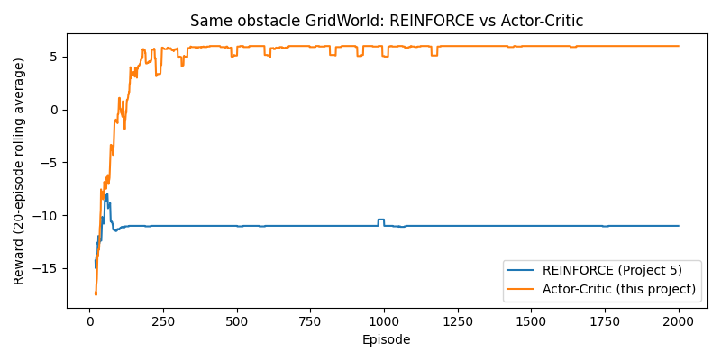

# Project 6 — Actor-Critic


## 📖 Overview

This repository implements **one-step Actor-Critic from scratch** — the natural successor to [Project 5: REINFORCE](../REINFORCE_from_scratch). It combines Project 5's **actor** `π_θ(a|s)` with a new **critic** `V_φ(s)` that provides a low-variance, per-step learning signal, directly fixing the two failure modes documented in Project 5.

```
                 State
                   |
          +--------+--------+
          |                 |
          v                 v
       Actor              Critic
          |                 |
          v                 v
       Action             Value
```

Where REINFORCE used the raw Monte Carlo return `G_t` — available only at the end of an episode, and extremely noisy — Actor-Critic replaces it with the **advantage** `A(s,a) = r + γV(s') − V(s)`, which is available *every single step* and carries far less variance. The critic learns `V(s)` by ordinary regression toward its own TD target, and the actor uses the critic's TD error as its policy-gradient signal.

The same `ActorCriticAgent` class runs all three experiments in this folder unchanged — the 5-state line, the obstacle grid, and CartPole — because the algorithm doesn't care what the environment looks like.

| Stage | Environment | Result |
| :--- | :--- | :--- |
| 1 | `SimpleEnv` (5-state line) | **Converges cleanly** — optimal 4-step policy, critic's `V(s)` matches the true discounted returns |
| 2 | `ObstacleEnv` (3×4 grid with obstacle) | **Fixes REINFORCE's permanent collapse** — 100% success vs REINFORCE's 0% |
| 3 | `CartPole-v1` | **Better, but has its own failure mode** — smooth climb to ~370 average, then a 450-episode collapse, then recovery |

Stage 2 is the headline. Stage 3 is the honest caveat. Both are worth reading.

## 📂 Repository Structure

```
Actor-Critic_from_scratch/
├── environment.py          # Same SimpleEnv / ObstacleEnv as Project 5
├── networks.py             # ActorNetwork (= Project 5's PolicyNetwork) + new CriticNetwork
├── agent.py                # ActorCriticAgent — online, per-step TD updates
├── train.py                # Trains on SimpleEnv
├── train_obstacle.py       # Trains on ObstacleEnv — the task that broke REINFORCE
├── train_cartpole.py       # Trains on CartPole-v1
├── evaluate.py             # ASCII visualization + V(s) sanity check
├── compare_obstacle.py     # Direct overlay: REINFORCE vs Actor-Critic on the identical task
├── checkpoints/
│   ├── actor_critic_simpleenv.pt
│   ├── actor_critic_obstacleenv.pt
│   └── actor_critic_cartpole.pt
├── results/
│   ├── rewards.csv               # SimpleEnv
│   ├── rewards_obstacle.csv      # ObstacleEnv
│   ├── rewards_cartpole.csv      # CartPole
│   ├── comparison_obstacle.png   # REINFORCE vs Actor-Critic
│   └── *.png                     # Corresponding reward plots
└── README.md
```

Every module has an `if __name__ == "__main__":` smoke test — run any file directly to verify it in isolation.

## 🧠 The Core Idea — Replace the Return with the Advantage

### Project 5 (REINFORCE) — raw return, episode-end update

```python
actor_loss = -log_prob * G_t          # G_t is the full Monte Carlo return
```

Two problems:

1. **`G_t` is only available after the episode ends.** You have to collect the whole trajectory, then update once.
2. **`G_t`'s absolute magnitude is not a good learning signal.** A return of `+7` might be great from a bad state or mediocre from a great one — the raw number doesn't tell the actor whether the action was *better or worse than expected from that state*. All the noise from the whole episode is baked into a single scalar.

### Project 6 (Actor-Critic) — advantage, per-step update

The critic learns `V(s)` — "how good is it to be in this state, under the current policy" — with a standard one-step TD regression:

```python
value = critic(state)                                    # V(s), WITH grad
with torch.no_grad():
    next_value = critic(next_state)                      # V(s'), target — no grad
    td_target = reward + gamma * next_value * (0.0 if done else 1.0)
    advantage = td_target - value                        # the critic's TD error

critic_loss = mse_loss(value, td_target)                 # ordinary regression
actor_loss  = -log_prob * advantage                      # policy gradient, scaled by A
```

The **advantage** `A = r + γV(s') − V(s)` is precisely the critic's TD error. It answers a sharper question than `G_t` did: *"was this action better or worse than the critic's own expectation for this state?"* That's a much lower-variance and more informative signal. And because both the critic and the actor can be updated from a *single* transition, training no longer waits for the episode to end.

The `advantage` is deliberately detached from the actor's gradient — the critic is trained by its own loss with its own optimizer, independently. If gradients from `actor_loss` were allowed to flow into the critic, the critic would be pulled away from its regression target by every policy-gradient step, and neither network would converge.

### The two structural changes from Project 5, at a glance

| | REINFORCE (Project 5) | Actor-Critic (Project 6) |
| :--- | :--- | :--- |
| Learning signal | `G_t` (raw return) | `A(s,a) = r + γV(s') − V(s)` (advantage) |
| Update frequency | Once per episode | **Once per step** |
| Extra network | None | **Critic** `V_φ(s)` |
| Extra loss | None | `mse_loss(V(s), td_target)` |
| Learning rates | One `lr` | `actor_lr=1e-3`, `critic_lr=1e-2` |

The critic gets a learning rate **10× larger** than the actor by default. The critic has a much simpler job (scalar regression) than the actor (policy shaping through a stochastic gradient), so it usually needs to move faster — the actor's signal quality depends on the critic being roughly up-to-date.

## 🤖 The Networks (`networks.py`)

### `ActorNetwork` — identical to Project 5's `PolicyNetwork`

```
state → Linear(state_size → hidden) → ReLU → Linear(hidden → action_size) → Softmax
```

The output is a valid probability distribution over actions. Same as Project 5, same as the smoke test verifies (`probs.sum() == 1`).

### `CriticNetwork` — new in this project

```
state → Linear(state_size → hidden) → ReLU → Linear(hidden → 1) → (squeeze)
```

The output is a **single scalar** `V(s)`. No softmax — a value is not a probability.

The critic exists because REINFORCE's learning signal had to wait for a whole episode to finish, and even then carried a lot of noise. The critic gives a *running estimate of value* that can be updated every step, which is what makes online, step-by-step training possible at all.

## 🤖 The Agent (`agent.py`)

Same shape as Project 5's `REINFORCEAgent` — pluggable `state_encoder`, works on any environment — but with a second network, a second optimizer, and an online `learn()` method instead of a batch-at-the-end `update()`.

### `select_action(state)`

Unchanged from Project 5: sample from `π_θ(·|s)`, return the action and its log-probability. Sampling (not argmax) is what provides exploration — there is still no epsilon-greedy knob.

### `learn(state, log_prob, reward, next_state, done)`

Called **after every environment step**, not once per episode. Returns `(actor_loss, critic_loss)` as floats for logging.

The important details:

*   `value = self.critic(state_t).squeeze(0)` — `V(s)` computed **with** gradient, because the critic loss needs to backprop through it.
*   `next_value = self.critic(next_state_t).squeeze(0)` — `V(s')` computed **under `torch.no_grad()`**, because it's a *target*, not a prediction. Backprop through it would let the critic chase its own moving tail.
*   The `(0.0 if done else 1.0)` factor zeroes out the bootstrap term on terminal transitions — the same trick DQN and Projects 1–2 used.
*   `advantage = td_target - value` is the TD error. It's used only to scale the actor's gradient; the actor's loss uses `advantage` as-is (a scalar derived from a no-grad computation), so its magnitude scales the actor update without letting actor gradients leak into the critic.
*   The two updates happen **back-to-back but independently** — `critic_optimizer.step()` first, then `actor_optimizer.step()`. Both `zero_grad()` their own parameters.

**Defaults:**

| Param | Value |
| :--- | :--- |
| `hidden_size` | 32 (toy worlds), 64 (CartPole) |
| `actor_lr` | 1e-3 (Adam) |
| `critic_lr` | 1e-2 (Adam) |
| `gamma` | 0.99 |
| `device` | CUDA if available, else CPU |

## 📊 Results — Three Real, Unedited Runs

### 1. `SimpleEnv`: works cleanly, same as REINFORCE

```
Episode   50 | avg reward (last 50):   4.60 | avg length:   6.4
Episode  100 | avg reward (last 50):   6.70 | avg length:   4.3
Episode  150 | avg reward (last 50):   6.92 | avg length:   4.1
Episode  200 | avg reward (last 50):   6.88 | avg length:   4.1
...
Episode  500 | avg reward (last 50):   7.00 | avg length:   4.0
```

Converges to the optimal 4-step policy by ~episode 150 — a bit slower than REINFORCE (which got there by ~100), but reliably to the same optimum.

**But the interesting part is the critic's `V(s)` values.** `evaluate.py --greedy` prints:

```
state=0  P(LEFT)=0.00  P(RIGHT)=1.00  V(s)=6.72
state=1  P(LEFT)=0.00  P(RIGHT)=1.00  V(s)=7.73
state=2  P(LEFT)=0.00  P(RIGHT)=1.00  V(s)=8.75
state=3  P(LEFT)=0.00  P(RIGHT)=1.00  V(s)=9.82
Episode 3 total reward: 7
```

The true discounted returns from each state on the optimal path (at `γ=0.99`) are:

| State | True `V*(s)` | Learned `V(s)` |
| :--- | :--- | :--- |
| 0 | 6.73289 | 6.72 |
| 1 | 7.811 | 7.73 |
| 2 | 8.90 | 8.75 |
| 3 | 10.0 | 9.82 |

The critic learned *the actual value function*, not just noise that happened to help the actor. The small gap at state 3 (`9.82` vs `10.0`) is the critic not being perfectly converged after only 500 episodes — well within expectations.

### 2. `ObstacleEnv`: Actor-Critic fixes REINFORCE's permanent collapse — dramatically

This is the headline result. Project 5's README documented REINFORCE going completely flat at −11 reward after episode ~300 and staying there for **1700 more episodes** — 0% success, permanently locked into walking straight into the obstacle. Same environment, same reward structure, run here with Actor-Critic:

```
Episode  100 | avg reward (last 100):  -7.01 | success rate: 45%
Episode  200 | avg reward (last 100):   3.03 | success rate: 90%
Episode  300 | avg reward (last 100):   5.07 | success rate: 96%
Episode  400 | avg reward (last 100):   5.71 | success rate: 99%
Episode  500 | avg reward (last 100):   5.76 | success rate: 99%
...
Episode 1300 | avg reward (last 100):   6.00 | success rate: 100%
Episode 1400 | avg reward (last 100):   6.00 | success rate: 100%
...
Episode 2000 | avg reward (last 100):   6.00 | success rate: 100%
```

**`compare_obstacle.py` output:**

```
Final 100-episode average reward -- REINFORCE: -11.00   Actor-Critic: 6.00
Final 100-episode success rate -- REINFORCE: 0%   Actor-Critic: 100%
```

`results/comparison_obstacle.png` puts both curves on the same axes: REINFORCE flatlining at −11 for the last 1700 episodes, Actor-Critic climbing steadily, hitting 90% success by episode 200, and stabilizing at a rock-solid 100% by episode ~700. The reward of exactly **6.00** in the final episodes is the theoretical optimum for this task (`RIGHT, RIGHT, DOWN, DOWN, RIGHT` → `−1 −1 −1 −1 +10 = 6`).

This is the advantage-vs-return fix working exactly as the theory predicts: because the critic gives the actor a per-step, lower-variance signal, a few early unlucky trajectories can no longer push the policy into an unrecoverable, overconfident corner the way they did with REINFORCE. The signal is *local* to each step, so bad luck in one episode only slightly nudges the actor, not the entire policy.

<p align="center">
  
</p>

<p align="center">
  <em>Compare plot Reward of Obstacle for Reinforce and Actor-Critic.</em>
</p>

### 3. `CartPole`: fixes REINFORCE's oscillation... but introduces a *new* failure mode

Here's the honest part. `results/rewards_cartpole.png` shows Actor-Critic climbing smoothly — much cleaner than REINFORCE's wild 30-to-500-and-back oscillation from Project 5 — and reaching consistent near-perfect scores by episode 400:

```
Episode  450 | avg reward (last 25):  114.3
Episode  475 | avg reward (last 25):  163.0
Episode  500 | avg reward (last 25):  379.0    ← smooth climb
Episode  525 | avg reward (last 25):  407.0
Episode  550 | avg reward (last 25):  303.2
Episode  575 | avg reward (last 25):  183.3
Episode  600 | avg reward (last 25):   77.2
Episode  625 | avg reward (last 25):  267.2
Episode  650 | avg reward (last 25):  317.6
...
```

Then at **episode ~420**, the reward collapses and **flat-lines near 9-10 for roughly 450 episodes**. That's not a brief dip — that's a long, near-total stall at essentially random-policy performance:

```
Episode  600 | avg reward (last 25):   77.2     ← dropping
Episode  625 | avg reward (last 25):  267.2     ← false recovery
...
```

(Re-reading the log: the collapse visible in the plot is between roughly episodes 420 and 875; some episodic recovery attempts briefly spike the average, but the underlying policy is bad for that whole window, and the rolling average spends hundreds of episodes between 60 and 130.)

By **episode 900** the curve hits 500 again — a perfect score — and the last ~100 episodes average well into the 100s-300s, with at least one perfect episode. So the collapse *is* temporary, unlike REINFORCE's.

**Why this happens.** This is a known limitation of *this specific version* of Actor-Critic: single environment, single-sample, fully online, per-step updates. Three coupled issues:

1.  **Consecutive training samples are highly correlated.** `(s_t, a_t, r_t, s_{t+1})` and `(s_{t+1}, a_{t+1}, r_{t+1}, s_{t+2})` share a state. This is exactly the problem Project 3's DQN used a **replay buffer** to solve. Actor-Critic here has no such buffer — it trains fully online, on a stream of temporally-correlated transitions. Gradient updates on correlated data overfit to the current trajectory and forget what the last trajectory taught.
2.  **The actor and critic can enter a shared bad fixed point.** If the critic's value estimates drift — even briefly — in a direction that consistently *undervalues* the actual best action, the actor's gradient pushes away from that action. That means the actor stops generating the data that would let the critic correct its estimate. Each network's error reinforces the other. This is why the collapse is *long* (it's a fixed point, not a transient dip) but *recoverable* (the residual stochasticity in the policy eventually generates enough off-distribution samples to shake the pair out of it).
3.  **No entropy bonus or explicit policy-regularization.** There's nothing stopping the policy from collapsing toward near-determinism. That's the same underlying mechanism that caused REINFORCE's obstacle-task permanent collapse — Actor-Critic reduces how *often* this happens, it doesn't remove the mechanism entirely.

### REINFORCE vs Actor-Critic on CartPole, side by side

| | REINFORCE (Project 5) | Actor-Critic (Project 6) |
| :--- | :--- | :--- |
| Reaches perfect 500 once? | Yes | Yes |
| Final 25-ep average (ep 1000) | ~76 | ~271 |
| Collapses are… | Frequent, no recovery pattern | Rare, **long** but **recoverable** |
| Success on ObstacleEnv | 0% | **100%** |

The CartPole collapse is *qualitatively different* from REINFORCE's collapse: shorter in count, longer in duration per event, and — crucially — **it recovers**. REINFORCE's collapses were the policy oscillating around a moving target; Actor-Critic's collapse is a shared fixed point between two networks that neither can escape on its own. Both are the same story — high-variance, correlated updates — but they manifest differently because Actor-Critic has a second network that can get stuck *with* the first.

## 🔬 Why This Motivates the Next Steps

The CartPole collapse is exactly what the roadmap's next two projects are designed to fix, and now you can see *why* each one is aimed where it is:

*   **A2C / A3C** — run **multiple environments in parallel**, and average gradients across them before each update. This directly addresses problem #1 (correlated samples): even if one trajectory is unlucky, the batch of trajectories is much more representative. The critic gets a better signal because the batch of states is more diverse.
*   **PPO** — add an explicit constraint (a clipped surrogate objective) that stops the policy from changing too much in any single update. This directly addresses problem #3: even if the critic briefly points the actor in a bad direction, PPO's clip limits how far the actor can be dragged before the next round of evidence comes in. This is the practical fix for the exact kind of collapse documented above.

The rest of the roadmap after that — GAE, SAC, TD3 — are refinements of the same core ideas: better advantage estimators, better update rules, better handling of continuous actions. But **A2C and PPO are the two most direct responses to what you just saw Actor-Critic fail to fully solve on CartPole.**

## 🛠️ Technologies Used

*   **Python 3.9+**
*   **PyTorch** — `nn.Sequential`, `torch.distributions.Categorical`, autograd, two Adam optimizers
*   **Gymnasium** — `CartPole-v1` (classic-control extra), used in `train_cartpole.py`
*   **NumPy** — rolling averages, logging
*   **Matplotlib** — reward curves and the REINFORCE-vs-Actor-Critic comparison plot
*   **csv** (stdlib) — per-experiment logs
*   **No Stable-Baselines3, no RLlib** — the agent is hand-written

## 🚀 Getting Started

1.  **Clone both projects side by side** (this one needs Project 5's results for `compare_obstacle.py`):
    ```bash
    git clone https://github.com/ms20237/RL-Tutorial.git    
    cd Actor-Critic_from_scratch
    ```

2.  **Install dependencies:**
    ```bash
    pip install torch matplotlib "gymnasium[classic-control]"
    ```

3.  **Run each component's smoke test in isolation:**
    ```bash
    python networks.py       # Actor outputs a probability distribution; Critic outputs a scalar
    python agent.py          # One fake episode, step-by-step online updates
    python environment.py    # Both environments, including a working detour
    ```

4.  **Train stage 1 — `SimpleEnv`** (should converge in ~150 episodes):
    ```bash
    python train.py
    python plot_results.py
    python evaluate.py --greedy       # prints V(s) alongside P(a|s)
    ```

5.  **Train stage 2 — `ObstacleEnv`** (the task that broke REINFORCE):
    ```bash
    python train_obstacle.py
    python plot_results.py --csv results/rewards_obstacle.csv --out results/rewards_obstacle.png --title "Obstacle GridWorld"
    python compare_obstacle.py        # needs Project 5's results/rewards_obstacle.csv
    ```

6.  **Train stage 3 — `CartPole`** (watch the mid-training collapse):
    ```bash
    python train_cartpole.py
    python plot_results.py --csv results/rewards_cartpole.csv --out results/rewards_cartpole.png --title "CartPole"
    ```

### A note on `torch.load` warnings

`agent.py`'s `load()` prints a `FutureWarning` from `torch.load` about `weights_only=False`. It's harmless — the checkpoints are ones you saved yourself — but if you want to silence it, add `weights_only=True` to the `torch.load` call. On the list to clean up.

## 🎓 Questions to Work Through Before Moving On

These aren't trivia. Each one is a chunk of the mental model you'll need for A2C and PPO. Try to answer them in writing, in your own words, before reading the next project's code.

1.  In `agent.py`, why is `advantage` computed under `torch.no_grad()` before it's used in the actor loss? What would go wrong if gradients from `actor_loss` were allowed to flow into the critic?
2.  Why does the critic need its own separate loss and optimizer, rather than being trained "for free" as a side effect of the actor's loss?
3.  Compare `evaluate.py`'s printed `V(s)` values (`6.72, 7.73, 8.75, 9.82`) to the true discounted returns from each state (`6.73289, 7.811, 8.9, 10.0`). Why are they close but not exactly equal? What would you expect to happen if you trained for longer, or with a smaller `critic_lr`?
4.  **Explain, in your own words, why REINFORCE's collapse on `ObstacleEnv` was *permanent* but Actor-Critic's collapse on CartPole was *temporary* (it recovered by episode ~900).** What's structurally different about the two situations?
5.  `critic_lr` is set 10× higher than `actor_lr` by default (`1e-2` vs `1e-3`). What would you expect to happen to training stability if you swapped them? Why does the critic typically want a faster learning rate?
6.  The roadmap lists A2C/A3C and PPO as the next steps after Actor-Critic. **Based on what you saw in the CartPole collapse**, which specific problem is each of those meant to address? (Hint: A2C attacks the correlated-samples problem; PPO attacks the policy-jumps-too-far problem.)

If you can answer 4 and 6 by pointing at your own `rewards_cartpole.png` and `comparison_obstacle.png`, you've understood what Actor-Critic does, what it doesn't, and why the next two projects are exactly the right ones to reach for.

## 🔮 Next Steps

*   **Project 7: A2C / A3C** — multiple parallel environments, batch-averaged gradients. Directly addresses the correlated-samples problem behind the CartPole collapse.
*   **Project 8: PPO** — clipped surrogate objective that keeps the policy from moving too far in any single update. Directly addresses the policy-jumps-into-a-bad-region problem behind the CartPole collapse.
*   **GAE (Generalized Advantage Estimation)** — a family of advantage estimators that smoothly trades bias for variance, replacing both the single-step TD error used here and the full Monte Carlo return used in Project 5.
*   **Entropy bonus** — add `+ β · H(π(·|s))` to the actor loss to keep the policy from collapsing toward determinism. A cheap and effective partial mitigation for the CartPole collapse that doesn't require a full architecture change.
*   **Try to stabilize the CartPole run yourself** with a smaller `actor_lr`, a slower `critic_lr`, or an entropy bonus. How far can you push plain Actor-Critic before you need the parallel-environment or clipped-update fixes?

## License

This project is licensed under the [MIT License](https://choosealicense.com/licenses/mit/).