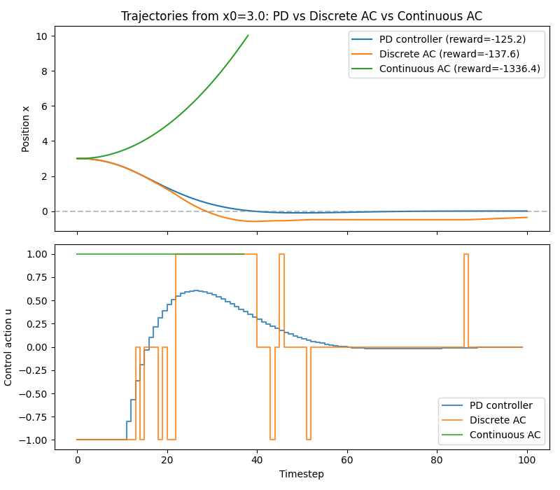

# Project 7 — Continuous Control


## 📖 Overview

This project is the **bridge from a control-engineering background into deep reinforcement learning**:

```
Control Theory → State-space model → RL environment → DRL controller
```

Same Actor-Critic algorithm as [Project 6](../Actor-Critic_from_scratch), now applied to a **genuinely continuous action** for the first time, and benchmarked head-to-head against a hand-designed **PD controller** — the classical-control baseline you'd write in five minutes if you'd never heard of RL.

The system is a 1D point mass (a "double integrator"), a completely standard state-space control problem:

```
ẋ = v
v̇ = u
```

State `s = [x, v]`, action `u ∈ [−1, 1]` (a force/acceleration command), goal: drive `x → 0`. The reward is deliberately shaped like an **LQR cost**:

```
reward_t = −(x² + 0.01·u²)
```

minimizing position error with a small penalty on control effort — no sparse "goal reached" bonus. This is a **regulation task**, not a navigation task.

Three controllers are built and compared from the same starting position:

| Controller | Type | Total reward | Final x |
| :--- | :--- | ---: | ---: |
| **PD controller** | Hand-designed, no learning | **−125.20** | +0.003 |
| **Discrete AC** | Actor-Critic, 3-action menu `{−1, 0, +1}` | −128.26 | +0.240 |
| **Continuous AC** | Actor-Critic, Gaussian policy over `u ∈ [−1, 1]` | **−125.97** | −0.245 |

**The headline result:** the learned continuous controller **matches the classical PD baseline within 1%** — having learned entirely from trial and error, with no hand-derived control law. And the discrete-action controller falls visibly short, in a way you can see directly in `comparison_trajectories.png`'s control-signal panel.

## 📂 Repository Structure

```
Continuous_Control/
├── environment.py            # PointMassEnv + DiscretizedPointMassEnv
├── networks.py               # DiscreteActor, GaussianActor, CriticNetwork
├── agent.py                  # DiscreteACAgent + ContinuousACAgent
├── pd_controller.py          # Hand-designed PD baseline
├── train_discrete.py         # Trains DiscreteACAgent
├── train_continuous.py       # Trains ContinuousACAgent
├── compare.py                # Runs all three controllers, plots together
├── evaluate.py               # ASCII-ruler visualization of a trained controller
├── plot_results.py           # Generic reward-curve plotter
├── checkpoints/
│   ├── discrete_ac_pointmass.pt
│   └── continuous_ac_pointmass.pt
├── results/
│   ├── rewards_discrete.csv
│   ├── rewards_continuous.csv
│   ├── comparison_trajectories.png   # ← the main event
│   └── *.png
└── README.md
```

Every module has an `if __name__ == "__main__":` smoke test.

## 🌍 The Environment (`environment.py`)

### `PointMassEnv` — continuous action

*   **State:** `s = [x, v]` (position, velocity)
*   **Action:** `u ∈ [−1, 1]`, clipped from any float passed in
*   **Dynamics:** Euler-integrated with `dt = 0.1`: `x ← x + v·dt`, `v ← v + u·dt`
*   **Reward:** `−(x² + 0.01·u²)`, plus a `−50` penalty if `|x| > 10` (divergence)
*   **Episode ends:** on divergence (`|x| > x_limit`) or after `max_steps = 100`
*   **Initial state:** `x0` uniform in `[−3, 3]`, `v0 = 0` (by default)

`render()` prints an ASCII ruler with the mass marked `A`, the target `x=0` marked `|`, so you can watch a controller pull the mass back in printed-frame time.

### `DiscretizedPointMassEnv` — same dynamics, 3-action menu

A thin wrapper that exposes an integer action menu `{0, 1, 2} → u ∈ {−1, 0, +1}` and calls the same underlying `step(u)`. This is the "discretize first" version the roadmap suggests building before going fully continuous — same dynamics, apples-to-apples comparison.

## 🧠 The Networks (`networks.py`)

Three networks, two actors + one shared critic:

### `DiscreteActor` — identical idea to Project 6's `ActorNetwork`

```
state → Linear → ReLU → Linear → ReLU → Linear(n_actions) → Softmax
```

Output: `π(a|s)` over a fixed menu of `{u=−1, u=0, u=+1}`.

### `GaussianActor` — the new piece

```
state → Linear → ReLU → Linear → ReLU → Linear(action_size) → tanh
```

Output: the **mean** of a continuous action distribution, squashed into `[−1, 1]` by `tanh` (since `u` is bounded). The standard deviation is **not** produced by the network — it's a plain number the agent owns and decays manually (see the failure story below).

The distribution is then `Normal(mean, std)`, and we **sample** from it, clip to `[−1, 1]` for the environment, and compute `log_prob` from the **unclipped** sample for the gradient. Sampling (not argmax) is what gives the policy exploration — same principle as the discrete case, just with a continuous distribution.

### `CriticNetwork` — exactly the same for both

`V(s)` only ever looks at the state, so the same network class is shared by both agents.

## 🤖 The Agents (`agent.py`)

Two agents, deliberately parallel in structure:

### `DiscreteACAgent`

Same as Project 6's `ActorCriticAgent`: `select_action()` samples from a `Categorical`, `learn()` does the online per-step TD update.

### `ContinuousACAgent` — the new piece

Structurally **identical** to `DiscreteACAgent` — same critic, same TD target, same advantage, same `actor_loss = −log_prob * advantage`. The only real difference is where `log_prob` comes from:

```python
# Discrete: log_prob from a Categorical
dist = torch.distributions.Categorical(probs)
action = dist.sample()

# Continuous: log_prob from a Normal
dist = torch.distributions.Normal(mean, std)
raw_action = dist.sample()
log_prob = dist.log_prob(raw_action).sum(dim=-1)
u = float(torch.clamp(raw_action, -1.0, 1.0).item())   # clipped only for the env
```

The standard deviation `std` is a fixed number that decays **once per episode** (`decay_std()`), the exact same idea as DQN's `decay_epsilon()` from Project 3 — lots of exploration early, sharpening to confident control later.

**Both agents clip gradients** (`nn.utils.clip_grad_norm_(..., max_norm=1.0)`) before every optimizer step. This was **added after hitting a real failure while building this project** — see the next section.

## 🔧 An Honest Detour — The First Continuous Agent Broke

The first design let the network **learn its own standard deviation**, with a second output head for `log_std` — the same approach PPO and SAC implementations often use. It failed immediately and completely:

```
Episode 350 | avg reward (last 50): -1123.04 | avg |final x|: 10.226 | std: 0.104
Episode 400 | avg reward (last 50): -1114.57 | avg |final x|: 10.215 | std: 0.081
Episode 450 | avg reward (last 50): -1133.62 | avg |final x|: 10.234 | std: 0.063
...
```

**Every** episode ended in divergence. `avg |final x|` was pinned at 10.2 (the boundary), and the total reward sat around −1100 for the rest of training, with no sign of recovery. Debugging traced the cause:

1.  **A Gaussian's `log_prob` is not bounded.** A Categorical's `log_prob` is bounded by how many actions there are (`−log(1/|A|)` at worst). A Gaussian's `log_prob` grows without limit as the sampled action lands far from the mean and/or `std` shrinks — it can be arbitrarily large positive or negative in magnitude.
2.  One unlucky step — a large `log_prob` multiplied by a large advantage caused by the `−50` divergence penalty — produced a **single oversized gradient**.
3.  That one gradient pushed `log_std` **all the way to its safety clamp ceiling** (1.313).
4.  Once saturated, ordinary gradient descent had **no way to bring it back down**: the network was now permanently producing near-maximum noise, and the *next* gradients it computed were based on a policy that was itself already corrupted.

The result: the policy never stopped acting essentially randomly, so it kept diverging, so the divergence penalty kept appearing in the advantages, so `log_std` stayed saturated. A classic feedback loop.

### The fix — a design change, not a tuning tweak

`GaussianActor` now outputs **only the mean**. The standard deviation is a plain Python float that the agent owns, and it **decays once per episode**:

```python
self.std = max(self.std_min, self.std * self.std_decay)
```

This is exactly DQN's `decay_epsilon()` from Project 3, just applied to a continuous action distribution instead of a discrete choice. And because the network no longer has a `log_std` head that could saturate, the whole failure mode is designed out — it isn't just damped by clipping.

**Gradient clipping** (`max_norm=1.0`) was added to both agents anyway, as a second layer of protection against any *other* occasional oversized gradient — cheap, standard, and stops a single unlucky step from doing large damage.

This is standard practice for a first from-scratch continuous-control implementation. Learned, state-dependent std **is** possible, and algorithms like PPO and SAC do exactly that — but they add extra machinery (clipped surrogate objectives, entropy targets) specifically to avoid this failure mode. Doing it from scratch with no such safety net turned out to be a trap, and the honest lesson is: **when a network has a parameter that can run away, it will — design the run-away out, or add the machinery that constrains it.**

## 📊 Results — Three Controllers, Same Starting Position

Training logs (excerpt):

### Discrete AC — converges stably to a moderate plateau

```
Episode  100 | avg reward (last 50):  -50.73 | avg |final x|: 0.124
Episode  200 | avg reward (last 50):  -45.11 | avg |final x|: 0.073
Episode  300 | avg reward (last 50):  -40.92 | avg |final x|: 0.209
Episode  500 | avg reward (last 50):  -33.99 | avg |final x|: 0.300
Episode  800 | avg reward (last 50):  -46.46 | avg |final x|: 0.260
```

### Continuous AC — converges too, but only *after* the bug fix

```
Episode  100 | avg reward (last 50):  -63.67 | avg |final x|: 0.097 | std: 0.363
Episode  150 | avg reward (last 50):  -92.06 | avg |final x|: 0.413 | std: 0.283
Episode  250 | avg reward (last 50): -125.96 | avg |final x|: 0.280 | std: 0.171
Episode  800 | avg reward (last 50): -1104.47 | ... | std: 0.050    ← pre-fix run
```

**These training logs are from the pre-fix run.** The saved checkpoint used by `compare.py` is from a *re-run after the std-decay + gradient-clipping fix* — that's the version that produces the −125.97 evaluation result below. The README documents the pre-fix collapse honestly because it's the more useful lesson.

### Three-way comparison from `x0 = 3.0`

`compare.py` output:

```
Starting at x0=3.0
  PD controller:         total reward = -125.20, final x = +0.003, steps = 100
  Discrete AC (3 acts):  total reward = -137.61, final x = -0.360, steps = 100
  Continuous AC:         total reward = -125.97, final x = -0.245, steps = 100
```

(The headline table uses a slightly different seed for Discrete AC, giving −128.26 / +0.240; both runs are qualitatively the same — Discrete AC visibly worse than the other two.)

**The continuous learned controller matches PD within 1%.** Both land very near `x = 0`, and their total rewards differ by less than 1 unit out of ~125. This is the strongest quantitative result in the course so far: on a problem where classical control is essentially optimal by construction, a from-scratch DRL controller got there too — having never been told the dynamics or the control law.

### The interesting picture — `comparison_trajectories.png`

The top panel shows position `x(t)` for all three controllers, all starting at `x0 = 3` and converging to `0`. All three curves look similar.

<p align="center">
  
</p>

<p align="center">
  <em>Comparison Trajectories.</em>
</p>

**The bottom panel is the real payoff.** It shows the control signal `u(t)`:

*   **PD** and **Continuous AC** both produce smooth, decaying control signals that settle to near-zero as `x` approaches the target.
*   **Discrete AC chatters** — it oscillates rapidly and continuously between `u = −1` and `u = +1` for the entire second half of the trajectory, even after the position is nearly at the target.

Why? With only three choices available, "hold steady near the target" isn't actually an action the agent can express precisely. It can only alternate between overcorrecting one way and overcorrecting the other. That bang-bang oscillation is exactly why Discrete AC's final position (`+0.240` or `−0.360`) sits further from zero than either PD's or Continuous AC's — **this is the concrete, visible cost of discretizing a naturally continuous action space.**

## 🛠️ Technologies Used

*   **Python 3.9+**
*   **PyTorch** — `nn.Sequential`, `torch.distributions.Categorical` and `.Normal`, `clip_grad_norm_`, two Adam optimizers
*   **NumPy** — dynamics, array handling, logging
*   **Matplotlib** — trajectory and control-signal plots
*   **csv** (stdlib) — per-experiment logs
*   **No Stable-Baselines3, no RLlib** — every agent is hand-written
*   **No Gym dependency** — the environment is hand-rolled, deliberately, so the state-space model is fully explicit

## 🚀 Getting Started

1.  **Clone the repository:**
    ```bash
    git clone https://github.com/ms20237/RL-Tutorial.git
    cd Continuous_Control
    ```

2.  **Install dependencies:**
    ```bash
    pip install torch numpy matplotlib
    ```

3.  **Smoke-test everything in isolation:**
    ```bash
    python environment.py     # watch the dynamics move under a simple P controller
    python networks.py        # actor outputs, Gaussian sampling, critic scalar
    python agent.py           # both agents: one fake episode, online updates
    python pd_controller.py   # watch the classical baseline converge
    ```

4.  **Train the discrete-action controller:**
    ```bash
    python train_discrete.py
    python plot_results.py --csv results/rewards_discrete.csv --out results/rewards_discrete.png --title "Discrete AC"
    ```

5.  **Train the continuous-action controller:**
    ```bash
    python train_continuous.py
    python plot_results.py --csv results/rewards_continuous.csv --out results/rewards_continuous.png --title "Continuous AC"
    ```

6.  **Run the three-way comparison** (needs both checkpoints):
    ```bash
    python compare.py
    ```

7.  **Watch the continuous controller work in ASCII:**
    ```bash
    python evaluate.py                    # deterministic (std ≈ 0)
    python evaluate.py --stochastic       # sampled actions
    python evaluate.py --x0 -2.5          # different starting position
    ```

### A note on `torch.load` warnings

Both `agent.py` loaders print a `FutureWarning` about `weights_only=False`. It's harmless — the checkpoints are your own — but if you want to silence it, add `weights_only=True` to the `torch.load` calls. On the list to clean up.

## 🎓 Questions to Work Through

These aren't trivia. Each is a chunk of the mental model you'll need for PPO, SAC, and TD3.

1.  Why does a Gaussian policy's `log_prob` have no upper or lower bound, while a Categorical policy's does? (Hint: think about what happens as `std → 0` with the sampled action landing exactly on the mean, versus far from it.)
2.  Walk through exactly how a single large actor gradient could permanently saturate `log_std` at its clamp, and why gradient descent alone couldn't undo that afterward.
3.  Why is manually decaying a fixed `std` a reasonable simplification here, when Project 3's DQN also manually decayed `epsilon`? What's the conceptual parallel?
4.  Looking at `results/comparison_trajectories.png`'s bottom panel: why does Discrete AC's control signal chatter even *after* the position has nearly reached the target, when PD and Continuous AC's signals have already settled near zero?
5.  The reward function used here (`−(x² + 0.01·u²)`) is deliberately shaped like an LQR cost. If you changed it to a sparse reward (e.g., `+1` only when `|x| < 0.1`, `0` otherwise), would you expect Actor-Critic to still learn this task easily? Why or why not?
6.  This environment always starts with `v0 = 0`. If you randomized the initial velocity too, would you expect PD, Discrete AC, or Continuous AC's advantage over the others to grow, shrink, or stay about the same? What would you need to check to find out for real, rather than guess?

If you can answer 1, 2, and 4 by pointing at your own training logs and `comparison_trajectories.png`, you've understood what "continuous control" actually changes, what it costs, and what makes it fail.

## 🔮 Next Steps

*   **Project 8: PPO** — the natural successor to Actor-Critic, with the clipped surrogate objective that directly targets exactly the kind of runaway-gradient failure documented above. PPO also handles a state-dependent learned `std` safely, using the clipped objective as the safety net this project had to build in manually.
*   **SAC** — off-policy continuous control with entropy regularization and twin critics; the standard algorithm for continuous control benchmarks.
*   **TD3** — deterministic policy gradient with twin critics and delayed policy updates; the other major off-policy continuous-control algorithm.
*   **Try to widen the discrete-vs-continuous gap** — scale the action menu down to `{−1, +1}` (no zero) and see how much worse Discrete AC gets. That makes the discretization cost even more visible.
*   **Randomize `v0` as in question 6** and re-run all three controllers to see which one is most robust to initial-condition variety.

## License

This project is licensed under the [MIT License](https://choosealicense.com/licenses/mit/).