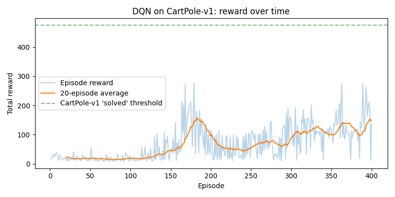

# DQN from Scratch (CartPole)


## 📖 Overview

This repository implements **Deep Q-Network (DQN) from scratch** — hand-written network, replay buffer, and agent — using PyTorch only as the autodiff and tensor library. No Stable-Baselines3, no RLlib, no `torchrl`. Every component is small enough to read in one sitting, and every file ships with its own smoke test so you can verify it in isolation before wiring it into the training loop.

The agent learns to balance a pole on a moving cart (**CartPole-v1**), the classic first DRL benchmark:

```
              pole
               |
               |
    -----------o----------------
             cart
```

This is the third project in the roadmap, after [Q-Learning from Scratch](../Q-Learning_from_scratch) and [SARSA from Scratch](../SARSA_from_scratch). Those used a hand-rolled GridWorld with 12 enumerable states and a Q-table. CartPole's state is **four continuous numbers** — `[cart position, cart velocity, pole angle, pole angular velocity]` — so there is no table to look up. That's what forces the switch to function approximation.

| Component | Project 1/2 (tabular) | Project 3 (DQN) |
| :--- | :--- | :--- |
| Q-values | `self.Q[state, action]` lookup | `net(state)` forward pass |
| Update | `Q[s,a] += α · td_error` | Backprop through Huber loss |
| Target stability | Implicit (table converges) | **Target network** (frozen snapshot) |
| Data | Used once, discarded | **Replay buffer** (random batches) |
| State space | 12 discrete cells | 4 continuous reals |

## 📂 Repository Structure

```
DQN_from_Scratch/
├── environment.py            # Thin wrapper around Gymnasium CartPole-v1
├── network.py                # QNetwork: 4 → 64 → 64 → 2 MLP
├── replay_buffer.py          # ReplayBuffer: deque of transitions, random sampling
├── agent.py                  # DQNAgent: online + target nets, act(), learn()
├── train.py                  # Full 10-step DQN cycle, logs to CSV, saves checkpoint
├── evaluate.py               # Greedy evaluation from a checkpoint
├── plot_results.py           # Reads CSV → rewards.png, lengths.png, epsilon.png, loss.png
├── checkpoints/
│   └── dqn_cartpole.pt       # Saved online net weights + epsilon
├── results/
│   ├── rewards.csv           # Per-episode: reward, length, epsilon, avg_loss
│   ├── rewards.png
│   ├── lengths.png
│   ├── epsilon.png
│   └── loss.png
└── README.md
```

**One responsibility per file**, following the doc's "build in stages" advice. Every module has an `if __name__ == "__main__":` smoke test at the bottom — run any of them standalone to check it works before trusting the full pipeline.

## 🌍 The Environment (`environment.py`)

A thin wrapper around `gymnasium.make("CartPole-v1")`, reshaped to the same `reset()` / `step()` signature as Projects 1–2:

```python
state = env.reset()                     # shape (4,) float array
next_state, reward, done = env.step(a)  # reward = +1 per timestep
```

*   **Actions:** `0` = push cart left, `1` = push cart right (discrete)
*   **Reward:** `+1` for every timestep the pole stays up
*   **Done:** pole angle exceeds ±12°, cart leaves the ±2.4 track, or 500 steps elapse
*   **So reward ≡ "how many steps you survived"** — the max possible is 500, and the commonly-cited "solved" threshold for CartPole-v1 is **475 average over 100 episodes**

The wrapper folds `terminated or truncated` into a single `done`, so `agent.learn()` only needs one flag to zero out the bootstrap term on terminal transitions — matching the `if done: target = reward` branch from Projects 1 and 2.

## 🧠 The Network (`network.py`)

The Q-table, replaced by a small MLP:

```
Input (4)  — cart pos, cart vel, pole angle, pole ang. vel
  |
Linear(4 → 64)
  |
ReLU
  |
Linear(64 → 64)
  |
ReLU
  |
Linear(64 → 2)  — one output per action
  |
Q(s, LEFT), Q(s, RIGHT)
```

`forward()` accepts a batch of states with shape `(batch_size, 4)` and returns `(batch_size, 2)`. That batch dimension is what makes experience replay possible — a whole batch of states goes through the network in one shot, and backprop trains on all of them at once.

## 🔁 The Replay Buffer (`replay_buffer.py`)

Consecutive experiences `(s₁,a₁,r₁,s₂) → (s₂,a₂,r₂,s₃) → …` are **highly correlated** — `s₂` literally depends on `s₁`. Neural networks trained on a temporally-correlated stream overfit to the recent past and catastrophically forget what they learned a few hundred steps ago.

The replay buffer fixes this by keeping a large deque of transitions (`capacity=10_000` by default, `deque(maxlen=...)` so the oldest fall off for free) and returning a **random batch** on each `sample(batch_size)`. Consecutive training batches are no longer correlated with each other, and each transition can be reused many times.

```
Replay Buffer (deque, maxlen=10_000)
+----------------------------+
| (s1, a1, r1, s2, done)     |   ← oldest falls off when full
| (s7, a0, r7, s8, done)     |
| (s3, a1, r3, s4, done)     |
| ...                        |
+----------------------------+
              ↓
    sample(batch_size=64) → random, decorrelated mini-batch
```

`sample()` returns five NumPy arrays `(states, actions, rewards, next_states, dones)` ready to be turned into tensors by the agent.

## 🤖 The Agent (`agent.py`)

`DQNAgent` ties everything together.

**Two networks, identical architecture:**

*   **`online_net`** — the one we actually train. Used for `act()` and for the "current Q-value" side of the loss.
*   **`target_net`** — a frozen snapshot of `online_net`'s weights, refreshed every `target_update_freq = 500` **gradient steps**. Used only to compute the Bellman target.

**Why two networks?** If `Q(s,a)` and `max_a' Q(s',a')` came from the same weights, every gradient step would move the target along with the prediction — the network would be chasing a target that runs away from it. Freezing a copy for a while keeps the target still long enough for the online network to actually converge towards it before the snapshot is refreshed. That's the "moving target" fix.

**`act(state)`** — ε-greedy on the online net's output:

```python
if random.random() < epsilon: return random action
else: return argmax(online_net(state))
```

Structurally identical to Projects 1–2's `choose_action()`; only the lookup changed from `self.Q[state]` to a forward pass.

**`learn(batch)`** — one training step:

```python
q_values = online_net(states).gather(1, actions)         # Q_θ(s, a) for actions taken
with torch.no_grad():
    next_q = target_net(next_states).max(dim=1).values   # max_a' Q_target(s', a')
    targets = rewards + gamma * next_q * (1.0 - dones)   # (1-dones) kills bootstrap at terminals
loss = smooth_l1_loss(q_values, targets)                 # Huber loss
optimizer.zero_grad(); loss.backward(); optimizer.step()
```

Note the `(1 - dones)` factor — it plays exactly the role of the `if done: target = reward` branch from Projects 1–2, but vectorized across the whole batch.

**Huber loss** (`smooth_l1_loss`) rather than MSE: it behaves like MSE for small errors but like MAE for large ones, so a single wildly-wrong target can't dominate the gradient.

**Defaults:**

| Param | Value |
| :--- | :--- |
| `hidden_size` | 64 |
| `lr` | 1e-3 (Adam) |
| `gamma` | 0.99 |
| `epsilon` | 1.0 → 0.05, decay 0.995 |
| `target_update_freq` | 500 gradient steps |
| `device` | CUDA if available, else CPU |

## 🔁 Training (`train.py`)

The full DQN cycle, matching the doc's 10 steps:

1. Reset environment
2. Select action (ε-greedy via `agent.act()`)
3. Execute action (`env.step()`)
4. Push transition into the replay buffer
5. Sample a random batch
6. Compute current Q-values \
7. Compute Bellman targets   } all inside `agent.learn()`
8. Compute Huber loss        /
9. Backprop + optimizer step
10. Every `target_update_freq` steps, sync `target_net ← online_net`

Training doesn't start until the buffer has `min_buffer_size=1000` transitions — sampling 64 with replacement from a nearly-empty buffer defeats the entire point of decorrelation.

**Defaults:** `n_episodes=400`, `max_steps=500`, `batch_size=64`, `buffer_capacity=10_000`, `seed=0`.

Per episode it logs: total reward, episode length, epsilon, and average training loss, written to `results/rewards.csv`. Checkpoint saved to `checkpoints/dqn_cartpole.pt`.

## 📊 Results — and the failure mode they reveal

This is the section worth reading carefully. The run below is real and unedited, and it demonstrates **the textbook DQN overestimation / instability problem**, not a bug.

**Reward trajectory over 400 episodes:**

| Episode range | Behavior |
| :--- | :--- |
| 1–160 | Reward flat at ~15–20 — barely better than random. Agent still exploring (ε > 0.4) and buffer still filling. |
| 160–220 | **Rapid improvement**: average reward climbs from ~15 to a **peak of ~164**. The network is genuinely learning to balance the pole. |
| 220–400 | **Collapse**: reward falls back to ~50–95 and gets *noisier* — even as ε keeps shrinking (less exploration, which should make the greedy policy *more* stable, not less). |

**Loss curve** (`results/loss.png`) tells the same story from a different angle: loss stays near zero through the good period, then climbs steadily for the rest of training.

**Greedy evaluation** of the final checkpoint (`evaluate.py`, ε = 0) gives **~95 steps per episode**, consistently. Much better than random (~10–20), far short of the "solved" threshold of **475** (the dashed green line in `rewards.png`).

<p align="center">
  
</p>

<p align="center">
  <em>Rewards curve of DQN network.</em>
</p>

### Why this happens

This is the classic **vanilla-DQN overestimation problem**:

1. The Bellman target uses `max_a' Q_target(s', a')`. **`max` is a biased estimator** — if the network's Q-value estimates carry any noise, `max` systematically picks out whichever action happens to have positive noise. Q-values drift upward over time. That drift *is* the climbing loss.
2. Once the online network's Q-values are distorted enough, the greedy policy `argmax Q(s,a)` starts preferring actions for the *wrong reasons* — the network is still "training" (loss is finite, weights are updating), but the policy it induces is getting worse.
3. A single moderately-sized buffer (10,000) over a long run also means later batches look increasingly different from the data the network was originally tuned on — the target distribution shifts under it.

**This is exactly what Double DQN fixes** — by using the *online* network to *select* the best next action and the *target* network to *evaluate* it, the `max` bias is removed. Seeing vanilla DQN's collapse firsthand makes Double DQN's fix click much harder than reading about it in the abstract. That's Project 4.

### Things worth trying yourself

Each of these is a knob that shifts *when* the collapse happens:

*   **Lower the learning rate** (`lr=1e-3 → 3e-4`) — does the collapse happen later, or not at all?
*   **Increase `target_update_freq`** (500 → 2000) — a more stable target should slow the drift.
*   **Increase `buffer_capacity`** (10,000 → 100,000) — a bigger, more diverse buffer dilutes stale/biased experience.
*   **Reward clipping** or **state normalization** — both common DQN stabilizers.
*   **Early-stopping at the peak** — checkpoint around episode 210 instead of at the end. In practice this is why people track a validation reward and keep the *best* checkpoint, not just the last one.

## 🛠️ Technologies Used

*   **Python 3.9+**
*   **PyTorch** — tensors, autograd, `nn.Sequential`, Adam optimizer
*   **Gymnasium** — `CartPole-v1` (classic-control extra)
*   **NumPy** — batch array assembly
*   **Matplotlib** — result plots
*   **csv** (stdlib) — training log
*   **No Stable-Baselines3, no RLlib, no torchrl** — the DQN is hand-written

## 🚀 Getting Started

1.  **Clone the repository:**
    ```bash
    git clone https://github.com/ms20237/RL-Tutorial.git
    cd DQN_from_Scratch
    ```

2.  **Install dependencies:**
    ```bash
    pip install torch "gymnasium[classic-control]" matplotlib numpy
    ```

3.  **Run each component's smoke test in isolation** (recommended, in this order — this is the "build in stages" workflow):
    ```bash
    python network.py         # Does the MLP produce the right output shape?
    python replay_buffer.py   # Does sample() return correctly-shaped batches?
    python agent.py           # Does learn() produce a finite (and decreasing) loss?
    python environment.py     # Does step() return the expected tuple?
    ```

4.  **Run the full training** (~400 episodes, a few minutes on CPU):
    ```bash
    python train.py
    ```

5.  **Plot the results:**
    ```bash
    python plot_results.py     # Writes results/rewards.png, lengths.png, epsilon.png, loss.png
    ```

6.  **Evaluate the saved checkpoint greedily:**
    ```bash
    python evaluate.py                    # 10 episodes, no rendering
    python evaluate.py --render           # with the CartPole window
    python evaluate.py --episodes 100     # more episodes for a tighter average
    ```

## 🔮 Next Steps

*   **Double DQN** — decompose `max_a'` into "online net picks `a*`, target net evaluates `Q_target(s', a*)`". This directly addresses the collapse documented above.
*   **Dueling DQN** — split the network into a state-value head `V(s)` and an advantage head `A(s,a)`, recombine as `Q = V + (A - mean(A))`.
*   **Prioritized experience replay** — sample transitions proportional to their TD error instead of uniformly.
*   **N-step returns** — bootstrap over `n` steps instead of one, trading bias for variance.
*   **Soft target updates** (Polyak averaging) instead of hard periodic syncs.

## License

This project is licensed under the [MIT License](https://choosealicense.com/licenses/mit/).