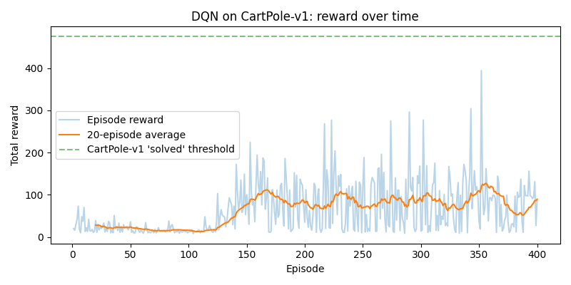
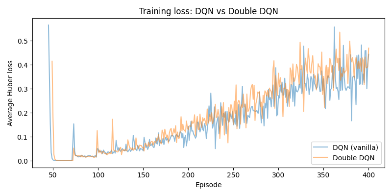
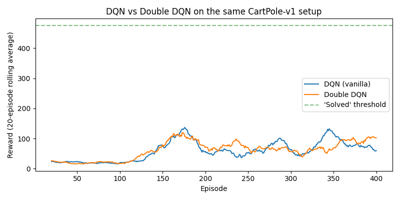

# Double DQN from Scratch (CartPole)


## 📖 Overview

This repository implements **Double DQN from scratch** — the fix for the Q-value overestimation problem you watched happen in [Project 3: DQN from Scratch](../DQN_from_Scratch). Every component is identical to Project 3 — same environment, same network, same replay buffer, same training loop, same hyperparameters — with **one change** in how the Bellman target is computed.

That's the point of this project. Double DQN isn't a different algorithm from the outside; it's a drop-in replacement for a single line of math inside `learn()`.

| Component | Project 3 (vanilla DQN) | Project 4 (Double DQN) |
| :--- | :--- | :--- |
| Environment | `CartPole-v1` | Same |
| Network | `4 → 64 → 64 → 2` MLP | Same |
| Replay buffer | `deque(maxlen=10_000)` | Same |
| Online + target nets | Yes | Same |
| Huber loss, Adam, ε-greedy | Yes | Same |
| **Bellman target** | `r + γ · max_a' Q_target(s', a')` | `r + γ · Q_target(s', a*)` where `a* = argmax_a' Q_online(s', a')` |

The one line that changes is the *whole reason this project exists*.

## 🧩 The Problem It Fixes

Vanilla DQN's target is:

```
y = r + γ · max_a' Q_target(s', a')
```

`max_a'` does **two jobs at once**, both using the same target network:

1. **Select** which next action looks best
2. **Evaluate** how good that action actually is

If the target network's Q-value estimates carry any noise — and they always do — `max` is a **biased estimator**. It systematically favors whichever action *happens* to have positive noise, because that's the action that "wins" the max. The errors don't cancel; they compound, because each episode's target depends on the (slightly too high) Q-values of the previous step. Q-values drift upward over training. That's the climbing loss and collapsing reward you saw in Project 3's `results/loss.png` and `rewards.png`.

## 🛠️ The Fix

Double DQN splits selection and evaluation across the two networks you *already have*:

```python
# Vanilla DQN (Project 3):
next_q_values = self.target_net(next_states).max(dim=1).values
#                ^^^^^^^^^^^ target net BOTH selects and evaluates

# Double DQN (this project):
best_next_actions = self.online_net(next_states).argmax(dim=1)                     # ONLINE selects
next_q_values = self.target_net(next_states).gather(
    1, best_next_actions.unsqueeze(1)
).squeeze(1)                                                                       # TARGET evaluates
```

For the Double DQN target to come out too high, **two independent things** would have to happen at once:

1. The **online** network would have to pick an action whose true value is low
2. The **target** network would have to *independently* overestimate that exact same action

That's possible but far less likely than a single network's noise reinforcing itself. **No third network is needed** — the target net already exists, and its job (evaluating a fixed action) is precisely the role it's suited for.

## 📂 Repository Structure

```
Double_DQN_from_scratch/
├── environment.py            # Unchanged from Project 3
├── network.py                # Unchanged from Project 3
├── replay_buffer.py          # Unchanged from Project 3
├── agent.py                  # DoubleDQNAgent — one different block in learn()
├── train.py                  # Same loop, imports the new agent
├── evaluate.py               # Greedy evaluation from checkpoint
├── plot_results.py           # This project's own reward/loss/epsilon/length plots
├── compare.py                # DQN vs Double DQN, side by side
├── checkpoints/
│   └── double_dqn_cartpole.pt
├── results/
│   ├── rewards.csv           # Per-episode: reward, length, epsilon, avg_loss
│   ├── rewards.png
│   ├── lengths.png
│   ├── epsilon.png
│   ├── loss.png
│   ├── comparison_rewards.png
│   └── comparison_loss.png
└── README.md
```

`compare.py` reads **both** this project's `results/rewards.csv` **and** Project 3's — so both folders need to sit side by side. Run Project 3's `train.py` first if you haven't.

## 🔁 Training — What Actually Happened

400 episodes, same seed (0), same hyperparameters, same network size as Project 3. Only the target computation differs.

### Training log (excerpt)

```
Episode   10 | avg reward (last 10):   28.1 | epsilon: 0.951 | avg loss: nan
Episode   50 | avg reward (last 10):   12.6 | epsilon: 0.778 | avg loss: 0.1797
Episode  100 | avg reward (last 10):   16.2 | epsilon: 0.606 | avg loss: 0.0450
Episode  150 | avg reward (last 10):   96.5 | epsilon: 0.471 | avg loss: 0.0566
Episode  160 | avg reward (last 10):  117.8 | epsilon: 0.448 | avg loss: 0.0811   ← peak region
Episode  200 | avg reward (last 10):   55.2 | epsilon: 0.367 | avg loss: 0.1290
Episode  250 | avg reward (last 10):   49.1 | epsilon: 0.286 | avg loss: 0.1521
Episode  300 | avg reward (last 10):   43.5 | epsilon: 0.222 | avg loss: 0.3652
Episode  350 | avg reward (last 10):   86.0 | epsilon: 0.173 | avg loss: 0.3519
Episode  400 | avg reward (last 10):   85.3 | epsilon: 0.135 | avg loss: 0.4698
```

The `avg loss: nan` entries for the first 40 episodes are expected: training doesn't start until the buffer holds at least `min_buffer_size=1000` transitions, so `losses` is empty and `np.mean([])` returns NaN. That's the buffer warm-up, not a bug.

### DQN vs Double DQN — head to head

| Metric | Vanilla DQN (Project 3) | **Double DQN (this project)** |
| :--- | :--- | :--- |
| Peak single-episode reward | 284 | **332** |
| Final 50-episode average reward | 71.7 | **96.1** |
| Greedy eval, avg over 10 episodes | ~95 steps | **109.3 steps** |
| Greedy eval, min / max | — | 64 / **165** |

Double DQN is ahead on **every** metric: a higher peak, a higher final average, a better greedy evaluation, and a higher *ceiling* in evaluation (a 165-step episode the vanilla agent never got close to). On `comparison_rewards.png`, Double DQN's rolling average climbs to a visibly higher plateau and holds it more consistently.

<p align="center">
  
</p>

<p align="center">
  <em>Rewards curve of Double DQN network.</em>
</p>

### The honest part: `comparison_loss.png`

Look at `comparison_loss.png` and you'll see something that doesn't match the tidy "Double DQN fixes overestimation" story:

**The two loss curves look similar.** Both climb steadily through the later episodes, and Double DQN's loss climbs *a little faster* if anything, ending around 0.47 by episode 400.

Double DQN **did not eliminate the instability** in this run. What it bought was **better peak and average performance despite similar loss volatility** — it's getting more useful learning done per unit of instability, not making the instability disappear.

There are reasons for this beyond overestimation bias:

*   **400 episodes is short.** With `buffer_capacity=10_000`, the buffer's contents shift a lot over the run — later batches look increasingly different from what the network was originally tuned on. The buffer itself is a moving target.
*   **A fixed learning rate late in training** keeps nudging the network even when it's already near a good policy.
*   **Huber loss measures the *magnitude* of TD error**, not the quality of the policy it induces. A climbing loss can reflect the network *starting to try harder* on states it previously ignored (because the policy improved and now visits them), not just overestimation. Loss and policy quality are not the same thing — which is the deeper point.

<p align="center">
  
</p>

<p align="center">
  <em>Compare plot Loss of Double DQN and DQN network.</em>
</p>

<p align="center">
  
</p>

<p align="center">
  <em>Compare plot Rewards of Double DQN and DQN network.</em>
</p>

### What this run actually teaches

Algorithm improvements in deep RL are rarely a clean fix. They're a **shift in where and how the remaining problems show up**. Double DQN removes the specific selection-vs-evaluation bias in the target, and that removes *one* source of upward Q-value drift — but other sources remain, and they show up in the loss curve looking just as noisy. The improvement shows up where it matters (the policy) rather than where it's easiest to plot (the loss). Sitting with that is the real lesson of this project, more than the peak-reward number.

## 🛠️ Technologies Used

*   **Python 3.9+**
*   **PyTorch** — tensors, autograd, `nn.Sequential`, Adam
*   **Gymnasium** — `CartPole-v1` (classic-control extra)
*   **NumPy** — array assembly, rolling averages
*   **Matplotlib** — result plots and comparison plots
*   **csv** (stdlib) — training log
*   **No Stable-Baselines3, no RLlib** — the agent is hand-written

## 🚀 Getting Started

1.  **Clone both projects side by side** (this one needs Project 3's results for `compare.py`):
    ```bash
    git clone https://github.com/ms20237/RL-Tutorial.git
    cd Double_DQN_from_Scratch
    ```

2.  **Install dependencies:**
    ```bash
    pip install torch "gymnasium[classic-control]" matplotlib numpy
    ```

3.  **Smoke-test the agent in isolation** (should run a few finite-loss steps):
    ```bash
    python agent.py
    ```

4.  **Train Double DQN** (~400 episodes, a few minutes on CPU):
    ```bash
    python train.py
    ```

5.  **Plot this project's own results:**
    ```bash
    python plot_results.py
    ```

6.  **Evaluate the trained checkpoint greedily:**
    ```bash
    python evaluate.py
    python evaluate.py --render           # with the CartPole window
    python evaluate.py --episodes 100     # tighter average
    ```

7.  **Compare against vanilla DQN** (requires Project 3's `results/rewards.csv`):
    ```bash
    python compare.py
    ```

### A note on `torch.load` warnings

`evaluate.py` prints a `FutureWarning` from `torch.load` about `weights_only=False`. It's harmless — the checkpoint is one you saved yourself — but if you want to silence it, add `weights_only=True` to the `torch.load` call in `agent.py`'s `load()`. This is on the list to clean up.

## 🔮 Next Steps

*   **Dueling DQN** — split the network into a state-value head `V(s)` and an advantage head `A(s,a)`, recombine as `Q = V + (A − mean(A))`. Orthogonal to Double DQN and stacks cleanly with it.
*   **Prioritized experience replay** — sample transitions proportional to TD error instead of uniformly.
*   **n-step returns** — bootstrap over `n` steps, trading bias for variance.
*   **Soft target updates (Polyak averaging)** — replace the hard every-500-steps sync with a `θ_target ← τ·θ_online + (1−τ)·θ_target` blend on every step.
*   **Longer runs + larger buffer** — the natural way to test whether the residual loss instability is intrinsic or just an artifact of training too short.
*   **Project 5: REINFORCE / Policy Gradient** — a different class of algorithm entirely. Instead of learning Q-values and deriving a policy from them, learn the policy *directly* by ascending the expected return's gradient.

## License

This project is licensed under the [MIT License](https://choosealicense.com/licenses/mit/).