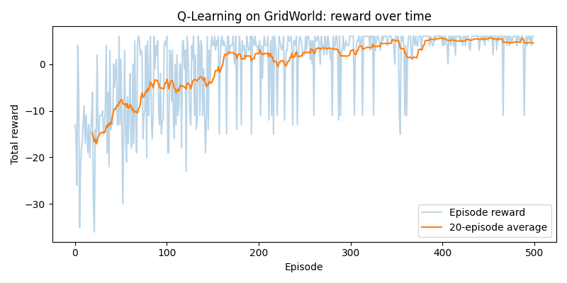

# Q-Learning from Scratch


## 📖 Overview

This repository implements **tabular Q-Learning from scratch** — no Gymnasium, no Stable-Baselines, no neural networks. Just NumPy, a hand-rolled GridWorld environment, and the classic Bellman update rule.

The goal is pedagogical: every line of the environment, the agent, and the training loop is meant to be readable and explainable. If you can walk through `train.py` line by line, you understand off-policy TD control. That's the prerequisite for the next project (SARSA, then DQN).

The agent learns to navigate a 3×4 grid from **S** to **G** while avoiding an obstacle **X**, and the project ships with tools to visualize *what it learned* — both the reward curve and the greedy policy it converged to.

## 📂 Repository Structure

```
Q-Learning_from_scratch/
├── environment.py           # GridWorld (the "black box", built from scratch)
├── agent.py                 # QLearningAgent with a NumPy Q-table
├── train.py                 # Training loop, saves q_table.npy
├── visualize.py             # Reward curve + greedy path + policy grid
├── models/
│   └── q_table.npy          # Saved Q-table after training
├── plots/
│   └── reward_curve.png     # Rolling-average reward per episode
└── README.md
```

## 🌍 The Environment (`environment.py`)

A deterministic 3×4 grid, written from scratch:

```
+---+---+---+---+
| S |   |   |   |
+---+---+---+---+
|   | X |   |   |
+---+---+---+---+
|   |   |   | G |
+---+---+---+---+
```

*   **S** = Start `(0, 0)` · **G** = Goal `(2, 3)` · **X** = Obstacle `(1, 1)`
*   **Actions:** `0=UP, 1=RIGHT, 2=DOWN, 3=LEFT`
*   **Rewards:** `+10` reach goal · `-10` hit obstacle (terminal) · `-1` every other move
*   **States:** flattened to a single integer via `state = row * n_cols + col` (12 states total)
*   Moving into a wall keeps you in place but still costs `-1`
*   `render()` prints the grid with the agent marked as `A`

The `-1` per-step penalty is what pushes the agent toward *short* paths, not just any path.

## 🧠 The Agent (`agent.py`)

A plain Q-table of shape `(n_states, n_actions)`, initialized to zeros. No function approximation.

**Behavior policy:** ε-greedy
*   With probability `ε`: pick a random action (explore)
*   Otherwise: pick `argmax_a Q(s, a)`, with ties broken randomly for stability

**Update rule (off-policy TD control):**

```
Q(s,a) ← Q(s,a) + α · [ r + γ · max_a' Q(s',a') − Q(s,a) ]
```

The `max_a'` over the *next* state is what makes Q-Learning **off-policy** — the target uses the best possible next action, regardless of what the agent will actually do next. (SARSA, by contrast, uses the action actually taken.)

**Hyperparameters (defaults):**

| Param | Value | Meaning |
| :--- | :--- | :--- |
| `alpha` | 0.1 | Learning rate |
| `gamma` | 0.99 | Discount factor — values future reward almost as much as immediate |
| `epsilon` | 1.0 → 0.05 | Exploration, decayed multiplicatively |
| `epsilon_decay` | 0.995 | Per-episode decay |
| `epsilon_min` | 0.05 | Floor so the agent never fully stops exploring |

## 🔁 Training Loop (`train.py`)

The whole algorithm fits in a nested loop:

```python
for episode in range(n_episodes):
    state = env.reset()
    for step in range(max_steps):
        action = agent.choose_action(state)
        next_state, reward, done = env.step(action)
        agent.update(state, action, reward, next_state, done)
        state = next_state
        if done: break
    agent.decay_epsilon()
```

Defaults: `n_episodes=500`, `max_steps=100`, `seed=0`. At the end, the Q-table is saved to `models/q_table.npy`.

**Training output (500 episodes):**

```
Episode   50 | avg reward (last 50): -12.32 | epsilon: 0.778
Episode  100 | avg reward (last 50):  -6.14 | epsilon: 0.606
Episode  150 | avg reward (last 50):  -4.12 | epsilon: 0.471
Episode  200 | avg reward (last 50):   2.20 | epsilon: 0.367
Episode  250 | avg reward (last 50):   1.30 | epsilon: 0.286
Episode  300 | avg reward (last 50):   2.94 | epsilon: 0.222
Episode  350 | avg reward (last 50):   4.18 | epsilon: 0.173
Episode  400 | avg reward (last 50):   3.86 | epsilon: 0.135
Episode  450 | avg reward (last 50):   5.20 | epsilon: 0.105
Episode  500 | avg reward (last 50):   4.78 | epsilon: 0.082
```

The agent starts out at roughly **−12** (wandering into walls and the obstacle) and climbs to **+5** — meaning it now consistently reaches the goal in ~5 steps, netting `10 − 5 = +5`. The residual noise at the top is from ε still decaying (0.082 at the end).

**Learned Q-table** (rows = states 0–11, cols = actions `[UP, RIGHT, DOWN, LEFT]`):

```
[[ 4.45  5.67  1.96  4.49]
 [ 5.40  6.73 -9.97  4.35]
 [ 6.21  7.81  7.27  5.33]
 [ 7.51  7.57  8.90  6.58]
 [ 4.10 -9.20 -1.37 -1.15]
 [ 0.00  0.00  0.00  0.00]     # obstacle cell — never entered
 [ 1.56  8.88  2.97 -7.18]
 [ 7.51  8.63 10.00  7.44]
 [-1.91  0.19 -0.96 -1.41]
 [-6.13  2.63 -0.27 -0.66]
 [ 1.19  8.15  0.94 -0.29]
 [ 0.00  0.00  0.00  0.00]]    # goal cell — terminal, never updated as a start
```

A couple of things worth noticing:

*   **Row 5 (the obstacle)** is all zeros — the agent can enter it, but doing so is terminal, so no Q-value ever gets bootstrapped there.
*   **Row 7 = state `(1,3)`**, which sits directly above the goal. `RIGHT` has the highest value (10.00), because `RIGHT` from `(1,3)` steps to `(2,3)`… actually into `(1,3)→(2,3)` is `DOWN`. Let me re-check: `(1,3)` is row 1 col 3; `DOWN` (`action 2`) leads to `(2,3)` = goal, reward `+10`. And indeed `Q[(1,3)][DOWN] = 10.00`. The other values are lower because they involve a detour.
*   **Row 4 = state `(1,0)`** — `UP` (4.10) is high because going up to `(0,0)` then across the top is the safe route; `RIGHT` is `-9.20` because it hits the obstacle for `-10`.

<p align="center">
  
</p>

<p align="center">
  <em>Reward Curve plot Q-learn.</em>
</p>

## 📊 Visualization (`visualize.py`)

Three tools, all driven from the trained `agent.Q`:

### 1. Reward curve (`plots/reward_curve.png`)
Raw per-episode reward (thin, noisy) plus a rolling average (smooth). Confirms the agent actually learned rather than just got lucky.

### 2. Learned policy grid
Prints an arrow for the greedy action in every non-obstacle cell:

```
 > | > | > | v
 ^ | X | > | v
 > | > | > | G
```

Read this as the agent's "map": from the start it wants to go right along the top row, then down the right column into `G`.

### 3. Greedy path (no exploration)
Runs the agent with `argmax` (ε = 0) and prints each step:

```
  -> RIGHT -> (0, 1) (reward -1)
  -> RIGHT -> (0, 2) (reward -1)
  -> RIGHT -> (0, 3) (reward -1)
  -> DOWN  -> (1, 3) (reward -1)
  -> DOWN  -> (2, 3) (reward 10)
Full path (row, col): [(0, 0), (0, 1), (0, 2), (0, 3), (1, 3), (2, 3)]
```

**5 moves, total reward = +5.** That's the optimal path: `S → right → right → right → down → down → G`. The agent avoided the obstacle entirely and took the shortest route around it.

## 🛠️ Technologies Used

*   **Python 3.9+**
*   **NumPy** — Q-table, ε-greedy sampling, Bellman updates
*   **Matplotlib** — reward curve
*   **No RL libraries** — the entire algorithm is ~40 lines of hand-written code

## 🚀 Getting Started

1.  **Clone the repository:**
    ```bash
    git clone https://github.com/ms20237/RL-Tutorial.git
    cd Q-Learning_from_scratch
    ```

2.  **Install dependencies:**
    ```bash
    pip install numpy matplotlib
    ```

3.  **Train the agent** (prints progress, saves `models/q_table.npy`):
    ```bash
    python train.py
    ```

4.  **Visualize the result** (retrains, then plots the curve and prints the policy + greedy path):
    ```bash
    python visualize.py
    ```

5.  **Sanity-check the environment on its own** (takes 5 random actions and renders each step):
    ```bash
    python environment.py
    ```

## 🔬 Things to Try

Some experiments that turn "I ran it" into "I understand it":

*   **Change `gamma`** to `0.5`. Does the agent still prefer the shortest path, or does it stop caring once it's "close enough"?
*   **Remove the `-1` step penalty.** The agent should still reach the goal, but the reward curve will look very different.
*   **Set `epsilon_decay=1.0`** (no decay). Watch the average reward plateau — the agent never stops exploring.
*   **Add a second obstacle** and retrain. Does the policy route around it cleanly, or does it need more episodes?
*   **Compare `alpha=0.01` vs `alpha=0.5`.** Low α learns slowly; high α is noisy and can oscillate.

## 🔮 Next Steps

*   **SARSA** — same environment, on-policy update (`Q(s,a) ← Q(s,a) + α[r + γ·Q(s',a') − Q(s,a)]`). Compare the learned policy and path-safety against Q-Learning.
*   **Expected SARSA** — swap the `max` for an expectation over the ε-greedy policy.
*   **DQN** — replace the Q-table with a small neural network so the same code scales to larger state spaces.
*   **Stochastic environment** — add a slip probability (e.g. 10% chance the agent moves perpendicular). Watch Q-Learning vs SARSA diverge.

## License

This project is licensed under the [MIT License](https://choosealicense.com/licenses/mit/).