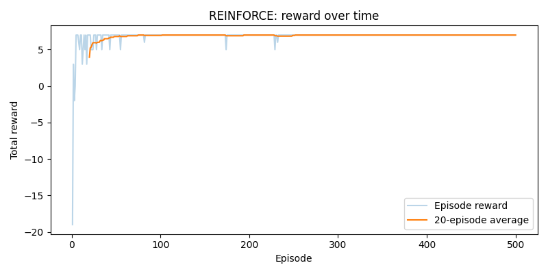

# Project 5 — Policy Gradient from Scratch (REINFORCE)


## 📖 Overview

This repository implements **REINFORCE — the original policy gradient algorithm — from scratch.** This is the first project in the roadmap where the network learns a **policy** `π_θ(a|s)` *directly*, rather than learning Q-values and deriving a policy via argmax. There is no Q-table, no Bellman target, no target network, no replay buffer, and no epsilon-greedy. The policy *is* the network, and it's trained by ascending the gradient of expected return.

The exact same `REINFORCEAgent` class runs all three experiments in this folder — a 5-state line world, a small obstacle grid, and CartPole — because the algorithm doesn't care what the environment looks like. Only the environment and the `state_encoder` change. That's the doc's point in section 17 made literally true in the code, not just asserted.

The project is deliberately built up in three stages of difficulty, and **the two harder stages both fail in instructive ways.** That's the real content of this README — not "here's REINFORCE working," but "here's exactly how and why plain REINFORCE breaks, and why the baseline/actor-critic fix in Project 6 is what's needed."

| Stage | Environment | Result |
| :--- | :--- | :--- |
| 1 | `SimpleEnv` (5-state line) | **Converges cleanly** — P(RIGHT) ≈ 0.99 everywhere, optimal 4-step episodes |
| 2 | `ObstacleEnv` (3×4 grid with obstacle) | **Permanently stuck** — collapses to reward = −11 by episode ~300, never recovers |
| 3 | `CartPole-v1` | **Wildly unstable** — repeatedly hits a perfect 500, repeatedly collapses under 100 |

The failures are the same underlying problem — **high-variance gradient estimates** — showing up in two different forms.

## 📂 Repository Structure

```
REINFORCE_from_scratch/
├── environment.py          # SimpleEnv (1D line) + ObstacleEnv (3×4 grid)
├── policy.py               # PolicyNetwork — softmax over actions
├── agent.py                # REINFORCEAgent — select_action(), compute_returns(), update()
├── train.py                # Trains on SimpleEnv
├── train_obstacle.py       # Trains on ObstacleEnv
├── train_cartpole.py       # Trains on Gymnasium's CartPole-v1
├── evaluate.py             # ASCII visualization + action probabilities for a trained SimpleEnv policy
├── plot_results.py         # Generic reward-curve plotter, reused across all three experiments
├── checkpoints/
│   ├── reinforce_simpleenv.pt
│   ├── reinforce_obstacleenv.pt
│   └── reinforce_cartpole.pt
├── results/
│   ├── rewards.csv             # SimpleEnv
│   ├── rewards_obstacle.csv    # ObstacleEnv
│   ├── rewards_cartpole.csv    # CartPole
│   └── *.png                   # Corresponding reward plots
└── README.md
```

Every module has an `if __name__ == "__main__":` smoke test — run any file directly to verify it in isolation before trusting the full pipeline.

## 🎯 The Five Things This Project Is Really About

Following the doc, these are the five conceptual pieces the code implements, each in one place:

| Concept | Symbol | Where |
| :--- | :--- | :--- |
| The policy | `π_θ(a\|s)` | `PolicyNetwork.forward()` in `policy.py` |
| Sampling an action | `a_t ~ π_θ(·\|s_t)` | `REINFORCEAgent.select_action()` |
| The return | `G_t = r_t + γr_{t+1} + γ²r_{t+2} + …` | `compute_returns()` in `agent.py` |
| The log-prob of the action | `log π_θ(a_t\|s_t)` | returned by `select_action()` |
| The policy-gradient loss | `L = −Σ_t G_t · log π_θ(a_t\|s_t)` | `REINFORCEAgent.update()` |

The minus sign is the trick that turns PyTorch's **gradient descent** into **gradient ascent** on expected return: minimizing `−G_t · log π` is the same as *maximizing* `G_t · log π`, which increases the probability of actions that led to high returns.

## 🌍 The Environments (`environment.py`)

### `SimpleEnv` — the sanity-check line world

```
[0] [1] [2] [3] [4]
 ^               ^
start           goal
```

*   **Actions:** `0 = LEFT`, `1 = RIGHT`
*   **Rewards:** `+10` for reaching state 4, `−1` for every other step
*   **Optimal behavior:** `RIGHT, RIGHT, RIGHT, RIGHT` → total reward `−1 −1 −1 +10 = 7`

This is deliberately trivial. If REINFORCE can't solve a 5-state line where the optimal action is "always go right," nothing else matters.

### `ObstacleEnv` — the "slightly harder" variant, corrected

The doc sketches the obstacle world as a 1D line: `S . . X . . G`. **On a strict 1D line that doesn't actually work.** There is only one path from start to goal, so an obstacle sitting on it cannot be gone around — backing up only delays hitting it, it doesn't avoid it. A genuine detour needs a second dimension.

So `ObstacleEnv` here reuses **Project 1's exact 3×4 GridWorld shape** — same obstacle at `(1,1)`, same goal at `(2,3)` — now controlled by a *policy network* rather than a Q-table:

```
+---+---+---+---+
| S |   |   |   |
+---+---+---+---+
|   | X |   |   |
+---+---+---+---+
|   |   |   | G |
+---+---+---+---+
```

*   **Actions:** `0=UP, 1=RIGHT, 2=DOWN, 3=LEFT` (matches Project 1 exactly)
*   **Rewards:** `+10` goal, `−10` obstacle (terminal), `−1` every other step
*   **State:** encoded as a single int `row * n_cols + col`, one-hot encoded to 12 dims

This is a good example of a doc's sketch being directionally right but needing a small correction to actually be buildable — worth noticing when it happens elsewhere.

## 🧠 The Policy Network (`policy.py`)

A two-layer MLP ending in **softmax**, so the output is a valid probability distribution over actions:

```
Input (state_size)
  |
Linear(state_size → hidden_size)
  |
ReLU
  |
Linear(hidden_size → action_size)
  |
Softmax(dim=-1)
  |
π(a|s) — a proper probability distribution, sums to 1
```

Given some state:

```
Left  0.20
Right 0.80
```

The agent **samples** from this distribution — it doesn't take argmax. That's where exploration comes from: there is no epsilon-greedy knob like DQN had, because the policy itself is stochastic. As training progresses, the probabilities sharpen toward 0/1 as the policy becomes confident.

## 🤖 The Agent (`agent.py`)

`REINFORCEAgent` is generic over how a raw environment state becomes a tensor, via a pluggable `state_encoder`:

```python
agent = REINFORCEAgent(
    state_size=env.n_states,
    action_size=env.n_actions,
    state_encoder=one_hot_encoder(env.n_states),   # for SimpleEnv / ObstacleEnv
    # or: state_encoder=identity_encoder,          # for CartPole — state is already 4 floats
    ...
)
```

That single class runs all three experiments unchanged. Two ready-made encoders are provided:

*   `one_hot_encoder(n_states)` — `int → one-hot (n_states,)`
*   `identity_encoder` — pass-through, for environments whose state is already a flat float vector

### `select_action(state)`

```python
probs = self.policy(state_t)
dist = Categorical(probs)
action = dist.sample()          # ← sample, don't argmax
log_prob = dist.log_prob(action)
return int(action.item()), log_prob
```

Returns **both** the action (to send to `env.step()`) and its log-probability (needed later for the loss). Not argmax — sampling is what gives the policy exploration for free.

### `compute_returns(rewards, gamma)`

Computes `G_t = r_t + γ·r_{t+1} + γ²·r_{t+2} + …` efficiently by scanning **backwards**, so each `G_t` reuses the `G_{t+1}` just computed: `G_t = r_t + γ·G_{t+1}`.

Hand-verified in the smoke test: for `rewards = [-1, -1, -1, 10]` and `gamma=0.99`, the returns are `[6.73289, 7.811, 8.9, 10.0]` — matching the code's output exactly.

### `update(log_probs, rewards)`

```python
returns = compute_returns(rewards, self.gamma)
returns_t = torch.tensor(returns, dtype=torch.float32)

if self.normalize_returns and len(returns_t) > 1:
    returns_t = (returns_t - returns_t.mean()) / (returns_t.std() + 1e-8)

loss = 0.0
for log_prob, G in zip(log_probs, returns_t):
    loss += -log_prob * G

optimizer.zero_grad(); loss.backward(); optimizer.step()
```

Called **once per complete episode**, not per step — you need the whole trajectory to compute returns.

**`normalize_returns`** (off by default in `train.py`, on in `train_obstacle.py` and `train_cartpole.py`) subtracts the episode's mean return and divides by its std. This is *not* part of vanilla REINFORCE — it's a cheap variance-reduction trick. It's the first hint of what Project 6 will formalize properly as a baseline.

## 📊 Results — Three Real, Unedited Runs

### 1. `SimpleEnv`: works cleanly

```
Episode   50 | avg reward (last 50):   5.54 | avg length:   5.5
Episode  100 | avg reward (last 50):   6.94 | avg length:   4.1
Episode  150 | avg reward (last 50):   7.00 | avg length:   4.0
Episode  200 | avg reward (last 50):   6.96 | avg length:   4.0
...
Episode  500 | avg reward (last 50):   7.00 | avg length:   4.0
```

Converges within ~100 episodes to the **optimal** policy: 4-step episodes, total reward **7** (the theoretical max, `−1 −1 −1 +10`). Nothing surprising — this is the "does the algorithm work at all" sanity check.

The greedy evaluation (`evaluate.py --greedy`) confirms it visually and numerically:

```
state=0  P(LEFT)=0.00  P(RIGHT)=1.00
state=1  P(LEFT)=0.00  P(RIGHT)=1.00
state=2  P(LEFT)=0.00  P(RIGHT)=1.00
state=3  P(LEFT)=0.00  P(RIGHT)=1.00
Episode 3 total reward: 7
```

The policy is **sharply confident** at every state — probabilities saturated at 0/1. This is exactly what "converged" looks like for a stochastic policy on a deterministic task.

### 2. `ObstacleEnv`: REINFORCE gets permanently stuck

```
Episode  100 | avg reward (last 100): -11.48 | success rate: 11%
Episode  200 | avg reward (last 100): -11.02 | success rate:  0%
Episode  300 | avg reward (last 100): -11.00 | success rate:  0%
Episode  400 | avg reward (last 100): -11.00 | success rate:  0%
...
Episode 2000 | avg reward (last 100): -11.00 | success rate:  0%
```

`results/rewards_obstacle.png` tells the story. Early on some episodes reach the goal (visible as spikes near episode 30–150, up to ~11% success rate). By episode ~300, the reward curve goes **completely flat at −11** — for the remaining **1700 episodes**, essentially every episode is identical: the agent walks straight into the obstacle and dies. Zero variance in the rolling average means literally every episode has become the same deterministic failure.

**The mechanism:**

*   REINFORCE's *only* source of exploration is the policy's own probability distribution — there is no epsilon-greedy knob.
*   If the policy becomes confident in a bad action early (by chance, or because a few unlucky trajectories happened to reinforce it), the probability of that action gets pushed toward 1.0 — meaning the agent almost never samples the alternative anymore.
*   Without ever trying the alternative, it never gets evidence that a different action would do better. **The policy has locked itself out of its own recovery.**

This is a **genuine limitation of vanilla REINFORCE**, not a bug in this code. Lowering the learning rate (`lr=1e-3` instead of `1e-2`) delays the collapse and gets a higher peak success rate (~26% vs the default's ~14%) but doesn't prevent it eventually happening. The algorithm has no mechanism to notice "I'm too confident, given how little I've actually explored."

### 3. `CartPole`: works, but wildly unstable

```
Episode  200 | avg reward (last 25):   66.7
Episode  250 | avg reward (last 25):   93.9
Episode  300 | avg reward (last 25):   75.0
Episode  350 | avg reward (last 25):   35.5   ← collapse
Episode  425 | avg reward (last 25):  148.8   ← recovery
Episode  500 | avg reward (last 25):  100.9
Episode  600 | avg reward (last 25):  153.0
Episode  650 | avg reward (last 25):  312.5   ← climbing
Episode  725 | avg reward (last 25):  500.0   ← PERFECT (episode cap)
Episode  800 | avg reward (last 25):  500.0   ← stays perfect
Episode  825 | avg reward (last 25):  445.3
Episode  850 | avg reward (last 25):  260.3   ← collapse
Episode  875 | avg reward (last 25):   96.0
Episode  900 | avg reward (last 25):   68.4   ← back to nearly random
```

`results/rewards_cartpole.png` is the clearest illustration in this whole project of the doc's "training can be very noisy" warning. The agent:

*   reaches a **perfect score of 500** (the episode cap) repeatedly — around episodes 90, 180, 450–500, 575–650, 725–800, 975
*   and **collapses back down to under 100** just as repeatedly — around episodes 30, 300, 500–550, 650–700, 850–900

It is **not** steadily converging. It's oscillating between "perfectly solved" and "barely better than random."

**Why:** each policy update uses the return from a *single* sampled episode. That single episode's outcome has a lot of luck baked into it. A policy that's currently very good can still get unlucky, receive a lower-than-deserved return on one episode, and get pushed in the wrong direction by that one unrepresentative sample. Reaching a perfect score once does not mean the policy has converged — it means one episode went well, and the *next* update is about to nudge the policy based on that.

### The common thread

Both failure cases are the same underlying problem: **high-variance gradient estimates.** The gradient of expected return, estimated from a single episode, is an unbiased but extremely noisy quantity. In the obstacle task that noise manifested as *permanent collapse*; in CartPole it manifested as *perpetual oscillation*. Neither is a code bug — both are structural properties of vanilla REINFORCE.

## 🔬 Why This Is the Motivation for Project 6 (Actor-Critic)

The standard fix is a **baseline**: replace `G_t` in the loss with `A_t = G_t − b(s_t)` for some function `b` (usually a learned `V(s)`).

Two facts make this work:

1.  **It doesn't change the gradient in expectation.** For *any* `b(s)` that doesn't depend on the action, `E[∇ log π(a|s) · b(s)] = 0` — the baseline term averages out to zero. So subtracting it doesn't bias the gradient; it only changes its *variance*.
2.  **It dramatically reduces variance** when `b(s)` approximates `V(s)`, because `G_t − V(s_t)` (the *advantage*) is typically much smaller in magnitude than raw `G_t` — especially in long episodes where `G_t` accumulates a lot of noise.

This is exactly what's needed for both failures above. In `ObstacleEnv`, lower-variance gradients mean the policy is much less likely to lock in on a bad action based on a few unlucky episodes. In CartPole, lower-variance gradients mean the policy is much less likely to be knocked off a working solution by one bad episode.

The `normalize_returns` flag already in `agent.py` is a poor-man's version of this — subtracting the *episode's own mean return* instead of a learned `V(s)`. It helps, but it's not enough; a **learned** baseline is what actually scales. That's Project 6.

<p align="center">
  
</p>

<p align="center">
  <em>Rewards curve of REINFORCE network.</em>
</p>

## 🛠️ Technologies Used

*   **Python 3.9+**
*   **PyTorch** — `nn.Sequential`, `torch.distributions.Categorical`, autograd, Adam
*   **Gymnasium** — `CartPole-v1` (classic-control extra), used in `train_cartpole.py`
*   **NumPy** — rolling averages, logging
*   **Matplotlib** — reward curves
*   **csv** (stdlib) — per-experiment logs
*   **No Stable-Baselines3, no RLlib** — the agent is hand-written

## 🚀 Getting Started

1.  **Clone the repository:**
    ```bash
    git clone https://github.com/ms20237/RL-Tutorial.git
    cd REINFORCE_from_scratch
    ```

2.  **Install dependencies:**
    ```bash
    pip install torch matplotlib "gymnasium[classic-control]"
    ```

3.  **Run each component's smoke test in isolation:**
    ```bash
    python policy.py         # Does the network produce a valid probability distribution?
    python agent.py          # Does update() run? Do compute_returns() values match by hand?
    python environment.py    # Both environments, including a working detour
    ```

4.  **Train stage 1 — `SimpleEnv`** (should converge in ~100 episodes):
    ```bash
    python train.py
    python plot_results.py
    ```

5.  **Train stage 2 — `ObstacleEnv`** (watch it collapse):
    ```bash
    python train_obstacle.py
    python plot_results.py --csv results/rewards_obstacle.csv --out results/rewards_obstacle.png --title "Obstacle GridWorld"
    ```

6.  **Train stage 3 — `CartPole`** (watch it oscillate):
    ```bash
    python train_cartpole.py
    python plot_results.py --csv results/rewards_cartpole.csv --out results/rewards_cartpole.png --title "CartPole"
    ```

7.  **Watch the trained `SimpleEnv` policy step by step:**
    ```bash
    python evaluate.py --greedy      # argmax, no sampling
    python evaluate.py               # stochastic (sampled) actions
    ```

### A note on `torch.load` warnings

`evaluate.py` and `agent.py` print a `FutureWarning` from `torch.load` about `weights_only=False`. It's harmless — the checkpoints are ones you saved yourself — but if you want to silence it, add `weights_only=True` to the `torch.load` call in `agent.py`'s `load()`. On the list to clean up.

## 🎓 Questions to Work Through Before Project 6 (Actor-Critic)

These aren't trivia. Each is a chunk of the mental model you'll need for actor-critic methods. Try to answer them in writing, in your own words, **before** reading Project 6's code.

1.  Why do we **sample** from the policy instead of taking argmax, the way DQN does?
2.  Walk through `compute_returns()` by hand for `rewards = [-1, -1, -1, 10]`, `gamma=0.99`. Do your numbers match the smoke test's output (`[6.73289, 7.811, 8.9, 10.0]`)?
3.  Why is there a **minus sign** in the loss (`L = −G_t · log π(a_t|s_t)`)?
4.  In `ObstacleEnv`, exactly what needed to be different from `SimpleEnv` for a detour to even be *possible*?
5.  **Looking at your own `rewards_obstacle.png`:** at what episode does the curve go flat, and what does "zero variance in the rolling average" tell you about what the policy has become?
6.  **Looking at your own `rewards_cartpole.png`:** why does reaching a perfect score once **not** mean the policy has converged?
7.  What's the conceptual difference between "the algorithm is unstable because of a bug" and "the algorithm is unstable because it's structurally missing a baseline"? Which one is REINFORCE?
8.  If you added a baseline `b(s)` and used `A_t = G_t − b(s_t)` instead of `G_t` in the loss, why would that reduce variance without changing what the gradient is, on average, pointing toward? (Hint: `E[∇ log π(a|s) · b(s)] = 0` for any `b` that doesn't depend on `a`.)

If you can answer 5, 6, and 8 by pointing at your own plots and the reasoning above, you've understood what REINFORCE does, what it *can't* do, and why the baseline fix is the right next step.

## 🔮 Next Steps

*   **Project 6: Actor-Critic (A2C)** — add a learned `V(s)` baseline, replace `G_t` with the advantage `A_t = G_t − V(s_t)`, and train both networks together. This directly addresses both failure modes documented above.
*   **Generalized Advantage Estimation (GAE)** — a family of advantage estimators that smoothly trades bias for variance, replacing the single-step TD error and the full Monte Carlo return.
*   **Entropy bonus** — add `+ β · H(π(·|s))` to the loss to keep the policy from collapsing to a near-deterministic distribution too early. This is a common and effective way to prevent the `ObstacleEnv` failure *without* changing the baseline.
*   **PPO** — the natural successor to A2C: clip the policy update so a single bad episode can't knock the policy off a working solution. This is the practical fix for the CartPole oscillation.
*   **Try to rescue `ObstacleEnv` yourself** with a lower learning rate, an entropy bonus, or `normalize_returns=True`. How far can you push vanilla REINFORCE before it needs a baseline?

## License

This project is licensed under the [MIT License](https://choosealicense.com/licenses/mit/).