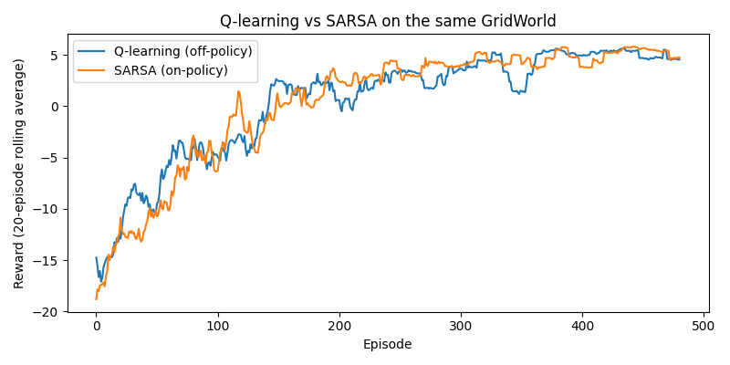

# SARSA from Scratch (On-Policy TD Control)


## 📖 Overview

This repository implements **tabular SARSA from scratch** — the on-policy sibling of Q-Learning. Same GridWorld, same ε-greedy behavior policy, same hyperparameters as [Project 1: Q-Learning from Scratch](../Q-Learning_from_scratch). The **only** difference is the TD target:

| Algorithm | TD target | Policy type |
| :--- | :--- | :--- |
| **Q-Learning** | `r + γ · max_a' Q(s', a')` | Off-policy |
| **SARSA** | `r + γ · Q(s', a')` where `a'` is the action the policy *actually* picked | On-policy |

That single change — `max` → the action actually taken — is what makes SARSA *on-policy*: its update depends on the behavior policy's own choices, including exploratory random moves. Because the project reuses the exact same environment and training schedule as Project 1, any difference in the final policy is attributable purely to on-policy vs off-policy learning.

The name **SARSA** comes from the tuple the update needs: **(S)tate, (A)ction, (R)eward, (S')tate, (A')ction**.

## 📂 Repository Structure

```
SARSA_from_scratch/
├── environment.py               # Same GridWorld as Project 1
├── agent.py                     # SarsaAgent (on-policy TD control)
├── train.py                     # SARSA training loop, saves q_table_sarsa.npy
├── visualize.py                 # Reward curve + policy grid + greedy path
├── compare.py                   # Q-Learning vs SARSA, side by side
├── models/
│   └── q_table_sarsa.npy        # Saved Q-table after training
├── plots/
│   ├── reward_curve.png         # SARSA reward curve
│   └── comparison.png           # Q-Learning vs SARSA overlaid
└── README.md
```

## 🌍 The Environment (`environment.py`)

Identical to Project 1 — a deterministic 3×4 grid, built from scratch:

```
+---+---+---+---+
| S |   |   |   |
+---+---+---+---+
|   | X |   |   |
+---+---+---+---+
|   |   |   | G |
+---+---+---+---+
```

*   **S** = Start `(0, 0)` · **G** = Goal `(2, 3)` · **X** = Obstacle `(1, 1)`
*   **Actions:** `0=UP, 1=RIGHT, 2=DOWN, 3=LEFT`
*   **Rewards:** `+10` goal · `-10` obstacle (terminal) · `-1` every other move
*   **States:** flattened via `state = row * n_cols + col` (12 states)

## 🧠 The Agent (`agent.py`)

A plain Q-table of shape `(n_states, n_actions)`, zero-initialized. The behavior policy (ε-greedy) is **byte-for-byte identical** to Project 1's — that's deliberate, so the comparison is clean.

**Update rule (on-policy TD control):**

```
Q(s,a) ← Q(s,a) + α · [ r + γ · Q(s',a') − Q(s,a) ]
```

The update signature also changes — SARSA's `update()` takes an extra `next_action` argument, because it literally needs to know what action the policy will take next:

```python
# Q-Learning
def update(self, state, action, reward, next_state, done): ...

# SARSA
def update(self, state, action, reward, next_state, next_action, done): ...
```

This is why SARSA's training loop can't just pick actions lazily — it must choose `a'` **before** calling `update`:

```python
# Q-Learning loop                     # SARSA loop
state = env.reset()                   state = env.reset()
                                      action = agent.choose_action(state)   # up front
while not done:                       while not done:
    action = choose(state)                next_state, reward, done = env.step(action)
    next_state, r, done = env.step(action) next_action = choose(next_state)   # before update
    agent.update(s, a, r, s', done)       agent.update(s, a, r, s', a', done)
    state = next_state                    state, action = next_state, next_action
```

**Hyperparameters** (identical to Project 1):

| Param | Value |
| :--- | :--- |
| `alpha` | 0.1 |
| `gamma` | 0.99 |
| `epsilon` | 1.0 → 0.05 |
| `epsilon_decay` | 0.995 |
| `epsilon_min` | 0.05 |

## 🔁 Training Output (500 episodes)

```
Episode   50 | avg reward (last 50): -14.56 | epsilon: 0.778
Episode  100 | avg reward (last 50):  -7.34 | epsilon: 0.606
Episode  150 | avg reward (last 50):  -3.66 | epsilon: 0.471
Episode  200 | avg reward (last 50):   0.70 | epsilon: 0.367
Episode  250 | avg reward (last 50):   3.02 | epsilon: 0.286
Episode  300 | avg reward (last 50):   3.62 | epsilon: 0.222
Episode  350 | avg reward (last 50):   4.42 | epsilon: 0.173
Episode  400 | avg reward (last 50):   4.64 | epsilon: 0.135
Episode  450 | avg reward (last 50):   4.74 | epsilon: 0.105
Episode  500 | avg reward (last 50):   5.28 | epsilon: 0.082
```

Same shape as Q-Learning's curve — starts around **−14**, climbs to **+5** as ε decays. The agent converges to roughly the same average reward, which is expected: on this tiny deterministic grid, the optimal policy is reached either way.

**Learned Q-table** (rows = states 0–11, cols = actions `[UP, RIGHT, DOWN, LEFT]`):

```
[[-0.79  3.97 -2.83 -1.51]
 [ 1.20  6.25 -9.87 -0.50]
 [ 1.23  7.62  0.87 -0.68]
 [ 4.08  5.48  8.81  3.24]
 [-4.64 -9.58  0.07 -3.65]
 [ 0.00  0.00  0.00  0.00]      # obstacle cell
 [-1.35  0.09  7.58 -7.71]
 [ 4.09  6.82 10.00  2.09]      # state (1,3), directly above G
 [-5.50  3.08 -2.21 -2.66]
 [-8.33  7.27  1.64 -2.50]
 [-2.15 10.00  3.27  0.08]      # state (2,2), one step LEFT of G
 [ 0.00  0.00  0.00  0.00]]     # goal cell
```

Compare this to Q-Learning's Q-table and you'll notice SARSA's values are **more conservative across the board** — look at state 0 (`(0,0)`), where Q-Learning had `RIGHT=5.67` vs SARSA's `3.97`. This is the classic SARSA signature: because its target uses the action actually taken (including random exploration), the update accounts for the chance that the agent *will* take a bad action occasionally. Q-Learning, always assuming optimal play next, is more optimistic.

The most visible consequence is at **state 4 `(1,0)`** — the cell directly left of the obstacle. Q-Learning's Q-table gives `RIGHT = -9.20`; SARSA gives `RIGHT = -9.58` (slightly more negative, but with a much higher `DOWN = 0.07` vs Q-Learning's `-1.37`). Both agents learned "don't go right into X", but SARSA hedges more strongly toward the safe downward route.

## 📊 Visualization (`visualize.py`)

Same three tools as Project 1, now for SARSA.

### 1. Reward curve (`plots/reward_curve.png`)
Raw per-episode reward plus a 20-episode rolling average.

### 2. Learned policy grid
```
 > | > | > | v
 v | X | v | v
 > | > | > | G
```

### 3. Greedy path (no exploration)
```
  -> RIGHT -> (0, 1) (reward -1)
  -> RIGHT -> (0, 2) (reward -1)
  -> RIGHT -> (0, 3) (reward -1)
  -> DOWN  -> (1, 3) (reward -1)
  -> DOWN  -> (2, 3) (reward 10)
Full path (row, col): [(0, 0), (0, 1), (0, 2), (0, 3), (1, 3), (2, 3)]
```

**5 moves, total reward = +5.** Identical to Q-Learning's greedy path — on this deterministic grid, both algorithms find the same optimal route.

## ⚖️ Q-Learning vs SARSA (`compare.py`)

`compare.py` loads `QLearningAgent` from Project 1 by file path (so both `agent.py` modules can coexist), trains both agents on the *same* environment with the *same* seed and hyperparameters, and overlays the results.

### Final policies

```
=== Q-learning policy ===     === SARSA policy ===
 > | > | > | v                  > | > | > | v
 ^ | X | > | v                  v | X | v | v
 > | > | > | G                  > | > | > | G

Greedy path:                   Greedy path:
[(0,0),(0,1),(0,2),(0,3),      [(0,0),(0,1),(0,2),(0,3),
 (1,3),(2,3)]                   (1,3),(2,3)]
```

**The greedy paths are identical, but the policies differ in two cells.** Look at row 2 (the middle row):

*   At `(1,0)` — directly below the start, left of the obstacle — **Q-Learning says `^`** (go UP to the top row), while **SARSA says `v`** (go DOWN and around the bottom).
*   At `(1,2)` — right of the obstacle — **Q-Learning says `>`** (toward the goal column), while **SARSA says `v`** (down first, then across).

This is the textbook on-policy vs off-policy divergence. Q-Learning's `max` makes it assume it will always take the best next action, so it's happy to route through cells adjacent to the obstacle — the *greedy* path is shortest. SARSA, which knows the agent sometimes explores randomly, learns to be **more conservative in risky cells**: from `(1,0)` it would rather go down and away from the obstacle than up and next to it, because a random `RIGHT` while exploring would be catastrophic (`−10`). Same story at `(1,2)`.

On a deterministic grid with no action noise, this difference is subtle. In the classic *Cliff Walking* environment — or any environment where the agent can slip into a penalty — SARSA's conservatism becomes dramatic and often preferable.

### Overlaid reward curves (`plots/comparison.png`)

The comparison plot shows both 20-episode rolling averages on the same axes. Q-Learning typically converges slightly faster (higher early rewards) because its `max` target propagates the `+10` goal value more aggressively; SARSA's learning is a touch smoother because its target is less optimistic. Over 500 episodes the two curves end up nearly overlapping — on this task both algorithms reach essentially the same performance.

<p align="center">
  
</p>

<p align="center">
  <em>Comparison plot of Reward curve between Q-learn and SARSA.</em>
</p>

## 🛠️ Technologies Used

*   **Python 3.9+**
*   **NumPy** — Q-table, ε-greedy sampling, TD updates
*   **Matplotlib** — reward curves and comparison plot
*   **importlib** — loads Project 1's `QLearningAgent` by file path for the head-to-head comparison
*   **No RL libraries** — everything is hand-written

## 🚀 Getting Started

1.  **Clone the repository** (this project expects Project 1 to sit alongside it as a sibling folder):
    ```bash
    git clone https://github.com/ms20237/RL-Tutorial.git
    cd SARSA_from_scratch
    ```

2.  **Install dependencies:**
    ```bash
    pip install numpy matplotlib
    ```

3.  **Train SARSA** (prints progress, saves `models/q_table_sarsa.npy`):
    ```bash
    python train.py
    ```

4.  **Visualize** the SARSA result (reward curve + policy + greedy path):
    ```bash
    python visualize.py
    ```

5.  **Run the head-to-head comparison** against Q-Learning:
    ```bash
    python compare.py
    ```

    This loads Project 1's agent via `../Q-Learning_from_scratch/agent.py`, so both folders must sit in the same parent directory.

## 🔬 Things to Try

The interesting experiments here are ones that *widen* the gap between the two algorithms:

*   **Add stochasticity to the environment.** Give the agent a 10–20% chance of slipping perpendicular to its intended action. Now SARSA's conservatism near the obstacle really matters — it will learn a wider berth, while Q-Learning keeps hugging the edge.
*   **Build Cliff Walking.** A 4×12 grid with a cliff along the bottom edge: falling in gives `−100` and resets to start. This is the canonical demonstration — Q-Learning learns the optimal (but risky) path along the cliff edge; SARSA learns the safe path one row up.
*   **Compare with `epsilon_min` higher**, e.g. `0.2`. Now even at convergence the agent explores 20% of the time, and SARSA's on-policy accounting of that risk becomes much more visible.
*   **Set a different seed** in `compare.py` and rerun. Do the two policies always diverge at the same cells, or is the difference seed-dependent?
*   **Expected SARSA.** Replace `Q(s', a')` with `Σ_a π(a|s') · Q(s', a')` — a variance-reduced middle ground between SARSA and Q-Learning.

## 🔮 Next Steps

*   **Expected SARSA** — same code, different target; usually the best of both worlds.
*   **Double Q-Learning** — addresses Q-Learning's maximization bias with two Q-tables.
*   **DQN** — replace the Q-table with a small neural network; SARSA's loop translates almost directly (you'd sample `a'` from the target network's ε-greedy policy).
*   **n-step SARSA** — propagate rewards over multiple steps before bootstrapping.

## License

This project is licensed under the [MIT License](https://choosealicense.com/licenses/mit/).